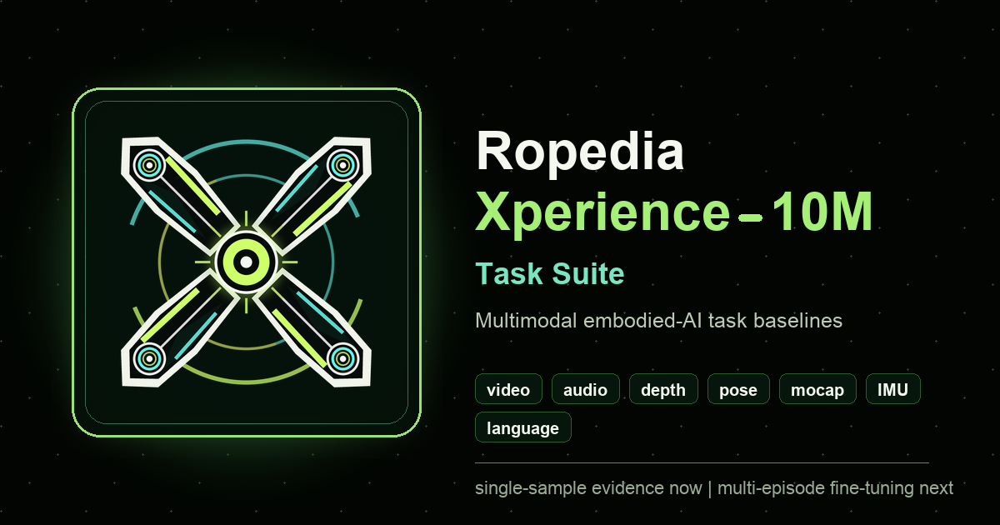

  

<h1 align="center">Ropedia Xperience-10M Task Suite</h1>

  

  <strong>Superficie pública multilingüe para Xperience-10M: datos de muestra, 20 tareas embodied-AI, baselines, diagnósticos Qwen3-Omni y Cosmos3, y direcciones de entrenamiento.</strong>

<!-- LANG-BAR:START -->

  <a href="README.md">English</a> ·
  <a href="README.zh.md">中文</a> ·
  <a href="README.es.md"><b>Español</b></a> ·
  <a href="README.fr.md">Français</a> ·
  <a href="README.de.md">Deutsch</a> ·
  <a href="README.ja.md">日本語</a> ·
  <a href="README.ko.md">한국어</a> ·
  <a href="README.pt.md">Português</a>

<!-- LANG-BAR:END -->

  
  
  
  
  
  

## Cómo Leer Este Proyecto

Este repositorio convierte el episodio público de muestra de Xperience-10M en un laboratorio verificable de tareas para embodied AI. Empieza por el panel visual y el estado del proyecto; después entra en las tareas, matrices de resultados y espejos de Hugging Face.

**Actualizado:** 2026-06-21.

**Alcance:** la suite reproducible usa un episodio público; los resultados de 128 episodios publican solo métricas, reportes, predicciones seguras y tarjetas de modelo. No se redistribuyen MP4/HDF5/RRD originales, pesos completos de Qwen ni datos gated.

## Dos Líneas de Evidencia

| Línea | Unidad de datos | Métodos y resultados | Uso |
| --- | --- | --- | --- |
| 1 episodio de muestra | 5,821 frames; 1,161 ventanas alineadas de 20 frames; 8,546 dimensiones. | Minimal + Neural MLP en 20 tareas; 40/40 registros con score; todos son direct scores. | Inspeccionar archivos de muestra, definiciones de tarea, baselines reproducibles y validez de tareas. |
| 128 episodios seleccionados | Split 96/16/16; 34,269 ventanas exportadas; features public-safe ligadas a episode paths oficiales gated. | Metadata simple/NN, raw-feature simple/NN, Qwen3-Omni, Cosmos3-Super y Cosmos3-Nano; 140/140 registros con score; 134 direct + 6 compact proxy. | Comparar baselines y ramas de modelo en el mismo split; los proxy targets permanecen visibles. |

Fórmula: 2 métodos de un episodio x 20 tareas = 40; 7 métodos de 128 episodios x 20 tareas = 140; matriz pública total = 180/180 registros con score.

Bloques de métodos: la línea 1 contiene task-head baselines (Minimal, Neural MLP). La línea 2 separa aligned baseline heads (metadata simple/NN, raw-feature simple/NN), la serie Qwen3-Omni (Qwen3-Omni v6 LoRA) y la serie Cosmos3 (Cosmos3-Super Reasoner, Cosmos3-Nano Future Window). Qwen3 v1-v6 es una línea interna de evolución LoRA/evaluación dentro de la línea 2, no las evidence lines del proyecto; la matriz de 20 tareas usa v6 y v5 queda como pinned prior release. Cosmos3-Super Forward-Dynamics LoRA se publica como adapter/pesos/resultados aparte y no cuenta como fila de método en la matriz de 20 tareas.

Entradas: [guia de dos lineas de evidencia](TWO_EVIDENCE_LINES.md), [datos de dos lineas](docs/data/two_evidence_lines.json), [tabla de 180 resultados](docs/data/task_method_20_result_matrix.json), [resumen de resultados de dos lineas](docs/data/two_evidence_line_result_summary.json).

## Ruta Rápida

| Objetivo | Entrada |
| --- | --- |
| Entender el proyecto | [resumen del proyecto](PROJECT_BRIEF.md), [estado del proyecto](PROJECT_STATUS.md) |
| Elegir la superficie correcta | [mapa publico de lectura](PUBLIC_READER_MAP.md) |
| Ver las 20 tareas | [guia de 20 tareas](TASK_SUITE_20.md), [datos de contratos de tarea](docs/data/task_suite_20.json) |
| Comparar resultados | [conclusiones de investigacion](RESEARCH_TAKEAWAYS.md), [tabla de 180 resultados](docs/data/task_method_20_result_matrix.json) |
| Inspeccionar una muestra | [explorador de un episodio](https://chaoyue0307.github.io/ropedia-xperience-10m-task-suite/single_episode_explorer.html), [mapa de archivos de muestra](docs/data/raw_sample_files.json) |
| Leer las tres direcciones foundation | [tres pipelines foundation](THREE_FOUNDATION_PIPELINES.md), [datos de contratos de pipeline](docs/data/three_foundation_pipelines.json) |
| Reproducir o auditar | [guia de reproducibilidad](REPRODUCIBILITY.md), [contrato de evidencia](EVIDENCE_CONTRACT.md) |

## Estructura

- Regla de lectura: si tiene una métrica, es una tarea de las 20; si explica qué estudia la evidencia, es una de las 4 research directions; si define inputs/outputs de entrenamiento, es una de las 3 foundation pipelines.
- Datos: ventanas de 20 frames con video, audio, profundidad, pose/SLAM, mocap, IMU, calibración y lenguaje.
- Tareas: 20 contratos para reconocimiento, predicción, recuperación, reconstrucción, sincronización, horizonte largo, relación acción-objeto y puentes de sensores.
- Resultados: minimal/NN de un episodio cubren 20/20; las ramas de 128 episodios separan metadata, raw features, Qwen3 y Cosmos; la matriz pública está en 180/180 registros con score: 174 direct y 6 compact proxy, con proxy targets visibles.
- Direcciones: spatial intelligence, human-video world model y vision-language-action tienen mapeo de tareas y requisitos de evidencia.

## Límite Público

El proyecto publica solo artifacts derivados, métricas, figuras, tarjetas y resúmenes public-safe. El uso de Xperience-10M sigue las condiciones oficiales de Ropedia en Hugging Face.

## Public Surfaces

| Surface | Link |
| --- | --- |
| GitHub | https://github.com/ChaoYue0307/ropedia-xperience-10m-task-suite |
| Website | https://chaoyue0307.github.io/ropedia-xperience-10m-task-suite/ |
| HF Space | https://huggingface.co/spaces/cy0307/ropedia-xperience-10m-task-suite |
| HF artifacts | https://huggingface.co/datasets/cy0307/ropedia-xperience-10m-task-suite-artifacts |
| HF baselines | https://huggingface.co/cy0307/ropedia-xperience-10m-task-baselines |
| HF weights/results | https://huggingface.co/cy0307/ropedia-xperience-10m-weights-results |
| HF collection | https://huggingface.co/collections/cy0307/ropedia-xperience-10m-task-suite |

## Glossary

Use `GLOSSARY.md` and `docs/data/glossary.json` for project terminology:
evidence line, 20-frame window, compact-proxy score, Qwen v1-v6,
Cosmos3-Super, LoRA adapter, HF artifact dataset, and related terms.

## Citation

Use `CITATION.cff` and cite the upstream Ropedia Xperience-10M dataset according to its official card.
