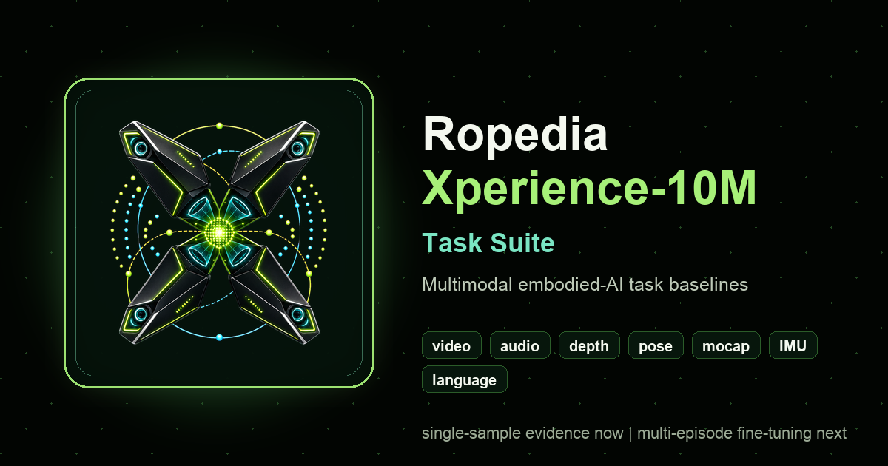
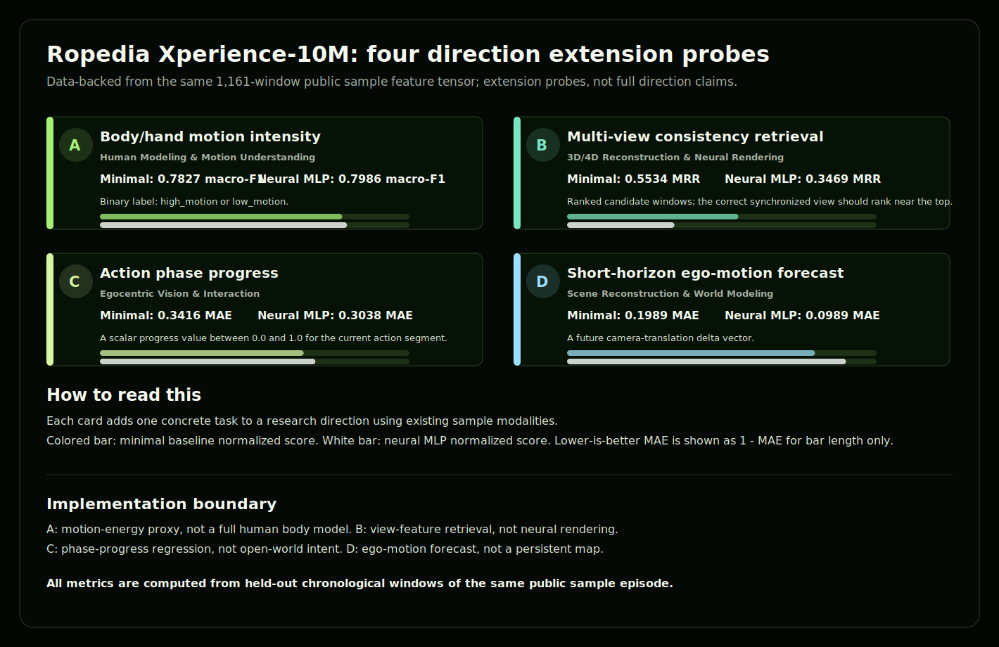

# Ropedia Xperience-10M Task Suite

[](https://chaoyue0307.github.io/ropedia-xperience-10m-task-suite/)
[](https://huggingface.co/spaces/cy0307/ropedia-xperience-10m-task-suite)
[](https://huggingface.co/datasets/ropedia-ai/xperience-10m)
[](#scope)
[](CITATION.cff)
[](LICENSE)

<p align="center">
  
</p>

A research-development project built on the public Xperience-10M sample episode
released by Ropedia. The goal is to make one richly multimodal egocentric
episode understandable, turn it into concrete embodied-AI task definitions, and
prepare the same pipeline for future held-out multi-episode training.

The central research questions are:

- What can be learned from one aligned Xperience-10M episode while separating
  sample-specific observations from later multi-episode questions?
- Which input/output tasks are meaningful for embodied AI when video, depth,
  pose, mocap, IMU, and language annotations are synchronized?
- What baseline models and evaluation files should exist before scaling to
  Qwen3-Omni or other multimodal foundation-model fine-tuning?

## Why This Project Exists

This project is organized as a compact research artifact around Xperience-10M:
start from a real public episode, make every modality and label path inspectable,
turn the data into concrete embodied-AI tasks, and keep the evaluation boundary
clear while preparing the next multi-episode experiments. The emphasis is on
research judgment as much as implementation: what the sample can show, what it
cannot show, and what evidence should exist before claiming model quality.

The work is designed to demonstrate four capabilities that matter for
embodied-AI research infrastructure:

| Capability | What this project shows |
| --- | --- |
| Multimodal data understanding | Parses the public sample into synchronized windows across video, audio, depth, pose/SLAM, mocap, IMU, calibration, and language-derived signals |
| Task design | Defines 12 human-readable tasks plus four direction-extension probes with inputs, outputs, process modules, metrics, and case-study walkthroughs |
| Model and evaluation discipline | Runs minimal and compact neural baselines, records predictions/metrics, keeps chronological split boundaries explicit, and separates sample evidence from held-out claims |
| Scale-up planning | Connects the public-sample pipeline to 32/128-episode held-out pilots, Qwen3-Omni LoRA, Cosmos-style world-model branches, and later policy-model branches |

## Start Here

For a first pass, use [`PROJECT_BRIEF.md`](PROJECT_BRIEF.md) or the
machine-readable [`docs/data/project_brief.json`](docs/data/project_brief.json).
They give the project shape in one page: what exists now, what the public
sample can support, where the 12 tasks and baselines live, and what must happen
before the multi-episode omni-model stage becomes a real held-out evaluation.

| Reader goal | Best entry point |
| --- | --- |
| Understand the whole project quickly | [`PROJECT_BRIEF.md`](PROJECT_BRIEF.md) |
| See the visual research dashboard | [GitHub Pages dashboard](https://chaoyue0307.github.io/ropedia-xperience-10m-task-suite/) |
| Navigate the 12 tasks, four tracks, and scale-up plan | [Interactive research roadmap](https://chaoyue0307.github.io/ropedia-xperience-10m-task-suite/research_roadmap.html), [`docs/data/research_roadmap_interactive.json`](docs/data/research_roadmap_interactive.json) |
| Compare current task metrics | [`RESEARCH_TAKEAWAYS.md`](RESEARCH_TAKEAWAYS.md), [`docs/data/summary_metrics.json`](docs/data/summary_metrics.json) |
| Compare possible foundation backbones | [`FOUNDATION_MODEL_PLAN.md`](FOUNDATION_MODEL_PLAN.md), [`docs/data/foundation_model_plan.json`](docs/data/foundation_model_plan.json) |
| Understand one model input | [`results/episode_task_suite/feature_manifest.json`](results/episode_task_suite/feature_manifest.json), [`results/episode_task_suite/windows.csv`](results/episode_task_suite/windows.csv) |
| Check multi-episode data status | [`results/omni_finetune/DATA_ACCESS_STATUS.md`](results/omni_finetune/DATA_ACCESS_STATUS.md) |

## Research Project Overview

| Theme | Current implementation |
| --- | --- |
| Dataset slice | One public Xperience-10M sample episode, 5,821 frames, 1,161 windows, and an 8,546-dimensional representation |
| Modalities | Video, audio, depth, camera pose/SLAM, hand/body mocap, IMU, calibration, and language annotations |
| Task suite | 12 human-readable embodied-AI task contracts with input, process, output, metrics, predictions, and case-study walkthroughs |
| Baselines | Minimal linear/ridge/logistic heads plus compact PyTorch MLP task heads over the same chronological split |
| Research directions | Task mapping and extension probes for human modeling, 3D/4D reconstruction, egocentric interaction, and world modeling |
| Scale-up path | The gated Xperience-10M dataset is available for a selected 128-episode pilot before Qwen3-Omni LoRA, followed by Cosmos 3/world-model and VLA/policy branches |
| Public surfaces | GitHub repo, GitHub Pages dashboard, HF Space, HF artifact dataset, HF baseline-model repo, and HF collection |

For the fastest interpretation of the current metrics, start with
[`RESEARCH_TAKEAWAYS.md`](RESEARCH_TAKEAWAYS.md) and
[`docs/data/research_takeaways.json`](docs/data/research_takeaways.json).
They summarize what the public sample results actually show: class shift under
chronological splits, neural gains on dynamics/order/alignment, harder
retrieval/reconstruction probes, and why the next model-quality step needs
held-out episodes.

Current contributions:

- manifested sliding-window features over the currently extracted modalities,
- motion-only and current all-feature baseline models,
- 12 end-to-end episode-level tasks,
- lightweight neural MLP heads for the same 12 task contracts,
- a generated four-direction research taxonomy matching the Ropedia job tracks,
- four additional direction-extension probes with minimal and neural baselines,
- human-readable research task cards and an interactive scrub/play walkthrough storyboard for every task,
- an interactive research roadmap connecting 12 tasks, four research tracks, current sample evidence, the Qwen3-Omni scale-up path, and foundation-model branch selection,
- a next-milestone track for Qwen3-Omni fine-tuning, Cosmos 3 world modeling, and sensor-bridge evaluation,
- metrics, predictions, model weights, manifests, charts, and a two-level
  tabbed static research website,
- a clear explanation of what is implemented now and what moves to the multi-episode stage.

## Current Research Scope

This repo separates implemented single-episode research artifacts from future
multi-episode held-out model metrics:

| Project layer | Evidence | Current scope |
| --- | --- | --- |
| Official Xperience-10M description | `XPERIENCE10M_DATASET_CARD_ALIGNMENT.md`, `docs/data/xperience10m_dataset_card_alignment.json` | aligns public wording with the official gated dataset card, public sample card, and HF API metadata; does not mirror raw data |
| Source alignment | `SOURCE_ALIGNMENT_AUDIT.md`, `docs/data/source_alignment_audit.json`, `scripts/validate_source_alignment.py` | records the same official dataset facts, public sample details, API-listing notes, and project coverage across repo, website, and HF cards |
| Figure index | `FIGURE_INDEX.md`, `docs/data/figure_index.json`, `scripts/build_figure_index.py` | catalogs public figures, charts, modality thumbnails, dimensions, hashes, roles, and source scripts |
| Brand assets | `docs/assets/brand/`, `docs/favicon.png`, `docs/apple-touch-icon.png`, `scripts/build_brand_assets.py` | applies the generated project logo system across the website, README, HF cards, favicon, and social previews |
| Data windows | `results/episode_task_suite/windows.csv`, `shared_windows.npz`, `summary_report.json` | one public sample episode |
| Feature contract | `results/episode_task_suite/feature_manifest.json`, `available_modalities.json` | documents the 8,546-dimensional multimodal representation and source coverage |
| Evaluation protocol | `EVALUATION_PROTOCOL.md`, `docs/data/evaluation_protocol.json`, `scripts/build_evaluation_protocol.py` | defines windowing, chronological split, leakage controls, per-task metrics, and current limitations |
| Research Takeaways | `RESEARCH_TAKEAWAYS.md`, `docs/data/research_takeaways.json`, `scripts/build_research_takeaways.py` | summarizes result interpretation from committed metrics and identifies which experiments need held-out episodes |
| Audio ablation | `scripts/audio_ablation_and_raw_upgrade.py`, `results/audio_ablation/`, `docs/data/audio_ablation_summary.json` | measures whether audio helps each of the 12 task contracts |
| Research roadmap | `RESEARCH_ROADMAP.md`, `docs/research_roadmap.html`, `docs/data/research_roadmap.json`, `docs/data/research_roadmap_interactive.json` | stages and visualizes the path from public-sample task development to multi-episode held-out evaluation, foundation-model selection, and larger omni/world-model extensions |
| Foundation-model plan | `FOUNDATION_MODEL_PLAN.md`, `docs/data/foundation_model_plan.json` | keeps Qwen3-Omni as the first trainable pilot, adds Cosmos 3 as the first world-model branch, and tracks OpenVLA/openpi/GR00T policy candidates |
| 12-task suite | `scripts/episode_task_suite.py`, per-task `metrics.json`, predictions | chronological single-episode split |
| Single-episode diagnostics | `scripts/single_episode_diagnostics.py`, `results/single_episode_diagnostics/`, `docs/single_episode_explorer.html` | modality ablations, timeline overlay, object-label export, alignment stress tests, and interactive window inspection from one sample episode |
| Neural heads | `scripts/neural_task_models.py`, `results/episode_task_suite/neural_mlp/` | compact MLP heads, not a foundation model |
| Research directions | `research_direction_taxonomy.json`, extension probe results | direct/proxy/diagnostic evidence, not full solutions |
| Task surface integrity | `docs/data/task_surface_integrity.json`, `scripts/validate_task_surface.py` | public task cards stay human-readable, thumbnail-backed, and wired to the scrub/play walkthrough storyboard |
| Rendered website check | `RENDERED_SITE_CHECK.md`, `docs/data/rendered_site_check.json`, `scripts/build_rendered_site_check.py` | records a browser-level load, tab, walkthrough deep-link, control-click, and console-health check |
| Public project surface | `PUBLIC_SURFACE_QA.md`, `docs/data/public_surface_qa.json`, `scripts/build_public_surface_qa.py` | presents the repo, website, and Hugging Face cards as one research project surface |
| Qwen3-Omni | `results/omni_finetune/DATA_ACCESS_STATUS.md`, `MULTI_EPISODE_ACCESS_STATUS.md` | the gated full dataset is available for a selected 128-episode pilot before held-out evaluation |
| Multi-episode pilot status | `scripts/validate_scope_claims.py`, `docs/data/scope_claims_audit.json` | separates setup artifacts, selected-episode preparation, and completed held-out-episode metrics |
| Mirror parity | `scripts/validate_mirror_parity.py`, `docs/data/mirror_parity.json` | prepared GitHub/HF mirrors carry matching data, figure, website HTML, and validator files |
| Public bundle contents | `scripts/validate_publication_package.py`, `docs/data/publication_audit.json` | summarizes the public repo and HF bundles, including raw-data exclusion and temporary local-file exclusion |
| Release checks | `QUALITY_GATES.md`, `docs/data/quality_gates.json`, `metrics/quality_gates.json`, `scripts/build_quality_gates.py` | one map for automated checks and live post-publish verification; the `metrics/` path is the Hugging Face model-repo mirror |
| Artifact index | `scripts/build_artifact_index.py`, `docs/data/artifact_index.json` | selective source-of-truth catalog with existence, size, and stable-file hashes |
| Project status | `PROJECT_STATUS.md`, `docs/data/project_status.json` | compact current-state table for first-pass readers |
| Citation and metadata | `CITATION.cff`, `codemeta.json`, `docs/data/project_manifest.json`, `LICENSE` | code is MIT-scoped; raw-data use follows Xperience-10M terms |
| Project path | `docs/data/project_packet.json`, website project path section | navigation guide across data, tasks, results, and scale-up status |

Read the full scope note in [`EVIDENCE_CONTRACT.md`](EVIDENCE_CONTRACT.md), or
consume the machine-readable copy at
[`docs/data/evidence_contract.json`](docs/data/evidence_contract.json).
The current release package report is at
[`docs/data/publication_audit.json`](docs/data/publication_audit.json).
The release-check summary is at
[`QUALITY_GATES.md`](QUALITY_GATES.md) and
[`docs/data/quality_gates.json`](docs/data/quality_gates.json).
The last live-publication verification report is at
[`docs/data/live_publication_status.json`](docs/data/live_publication_status.json).
The current prepared-mirror parity report is at
[`docs/data/mirror_parity.json`](docs/data/mirror_parity.json).
The current multi-episode pilot status note is at
[`docs/data/scope_claims_audit.json`](docs/data/scope_claims_audit.json).
The task-card and walkthrough-storyboard integrity report is at
[`docs/data/task_surface_integrity.json`](docs/data/task_surface_integrity.json).
The public presentation report is at
[`PUBLIC_SURFACE_QA.md`](PUBLIC_SURFACE_QA.md) and
[`docs/data/public_surface_qa.json`](docs/data/public_surface_qa.json).
The generated evaluation protocol is at
[`EVALUATION_PROTOCOL.md`](EVALUATION_PROTOCOL.md) and
[`docs/data/evaluation_protocol.json`](docs/data/evaluation_protocol.json).
The generated research takeaways are at
[`RESEARCH_TAKEAWAYS.md`](RESEARCH_TAKEAWAYS.md) and
[`docs/data/research_takeaways.json`](docs/data/research_takeaways.json).
The research roadmap is at
[`RESEARCH_ROADMAP.md`](RESEARCH_ROADMAP.md) and
[`docs/data/research_roadmap.json`](docs/data/research_roadmap.json).
The foundation-model selection plan is at
[`FOUNDATION_MODEL_PLAN.md`](FOUNDATION_MODEL_PLAN.md) and
[`docs/data/foundation_model_plan.json`](docs/data/foundation_model_plan.json).
The source-of-truth artifact index is at
[`docs/data/artifact_index.json`](docs/data/artifact_index.json).
For a human-readable artifact map, use
[`ARTIFACT_GUIDE.md`](ARTIFACT_GUIDE.md).
For reproduction commands and expected outputs, use
[`REPRODUCIBILITY.md`](REPRODUCIBILITY.md) and
[`docs/data/reproducibility_matrix.json`](docs/data/reproducibility_matrix.json).
Project citation and machine-readable metadata live in
[`CITATION.cff`](CITATION.cff), [`codemeta.json`](codemeta.json), and
[`docs/data/project_manifest.json`](docs/data/project_manifest.json).
The upstream dataset-card alignment note is
[`XPERIENCE10M_DATASET_CARD_ALIGNMENT.md`](XPERIENCE10M_DATASET_CARD_ALIGNMENT.md),
with a machine-readable copy at
[`docs/data/xperience10m_dataset_card_alignment.json`](docs/data/xperience10m_dataset_card_alignment.json).
The generated source-alignment note is at
[`SOURCE_ALIGNMENT_AUDIT.md`](SOURCE_ALIGNMENT_AUDIT.md) and
[`docs/data/source_alignment_audit.json`](docs/data/source_alignment_audit.json).
The generated figure index is at
[`FIGURE_INDEX.md`](FIGURE_INDEX.md) and
[`docs/data/figure_index.json`](docs/data/figure_index.json).
The project logo system is packaged by
[`scripts/build_brand_assets.py`](scripts/build_brand_assets.py), stored under
[`docs/assets/brand/`](docs/assets/brand/), and indexed in
[`docs/data/brand_assets.json`](docs/data/brand_assets.json).

## Project Status

If you only have one minute, use
[`PROJECT_STATUS.md`](PROJECT_STATUS.md) and
[`docs/data/project_status.json`](docs/data/project_status.json).
They give the current research state in one compact table:

| Area | Current decision |
| --- | --- |
| Public-sample pipeline | Verified on one public sample episode: 5,821 frames, 1,161 windows, 8,546 dimensions |
| 12-task suite | Verified minimal baselines with committed metrics, predictions, and manifests |
| Neural heads | Verified compact PyTorch MLP heads over the same task contracts and chronological splits |
| Official dataset wording | Verified against the public `ropedia-ai/xperience-10m` dataset card/API metadata |
| Source alignment | Source facts, sample details, API-listing notes, and project coverage are consistent across repo, website, and HF cards |
| Evaluation protocol | Verified generated protocol for windowing, split policy, leakage controls, and per-task metrics |
| Website and HF mirrors | Verified by website reference reports, public presentation reports, mirror parity, and live-publication checks; the public dashboard uses six top-level tabs, including an explicit Directions tab, plus subsection tabs for dataset, task-suite, method, result, direction, and resource views |
| Qwen3-Omni multi-episode pilot | The gated Xperience-10M dataset is available for selected 128-episode preparation, with full metrics pending completed preprocessing, training, and held-out evaluation |
| Raw Xperience-10M data / full Qwen weights | Not redistributed |

## 90-Second Research Project Path

If you are reading the project cold, open these in order:

| Step | Question | Primary artifacts | What should be true |
| --- | --- | --- | --- |
| 1 | What has been implemented? | [`PROJECT_BRIEF.md`](PROJECT_BRIEF.md), [`PROJECT_STATUS.md`](PROJECT_STATUS.md), [`docs/data/project_status.json`](docs/data/project_status.json), [`ARTIFACT_GUIDE.md`](ARTIFACT_GUIDE.md), [`docs/data/artifact_index.json`](docs/data/artifact_index.json), [`docs/data/figure_index.json`](docs/data/figure_index.json) | Single-episode task engineering, visual assets, mirrors, and scale-up status are summarized for first-pass reading. |
| 2 | What is the official upstream dataset? | [`XPERIENCE10M_DATASET_CARD_ALIGNMENT.md`](XPERIENCE10M_DATASET_CARD_ALIGNMENT.md), [`docs/data/xperience10m_dataset_card_alignment.json`](docs/data/xperience10m_dataset_card_alignment.json), [official HF dataset](https://huggingface.co/datasets/ropedia-ai/xperience-10m) | The full dataset is described as a gated large-scale 4D multimodal egocentric source; this repo validates only one public sample episode. |
| 3 | Are source facts consistently presented? | [`SOURCE_ALIGNMENT_AUDIT.md`](SOURCE_ALIGNMENT_AUDIT.md), [`docs/data/source_alignment_audit.json`](docs/data/source_alignment_audit.json), [`scripts/validate_source_alignment.py`](scripts/validate_source_alignment.py) | Repo, website, and HF cards use the same full-dataset facts, sample-card facts, API-listing notes, and project coverage. |
| 4 | How exactly are tasks evaluated? | [`EVALUATION_PROTOCOL.md`](EVALUATION_PROTOCOL.md), [`docs/data/evaluation_protocol.json`](docs/data/evaluation_protocol.json), [`scripts/build_evaluation_protocol.py`](scripts/build_evaluation_protocol.py) | The window unit, chronological split, leakage controls, task metrics, and current limitations are explicit. |
| 5 | What do the current results mean? | [`RESEARCH_TAKEAWAYS.md`](RESEARCH_TAKEAWAYS.md), [`docs/data/research_takeaways.json`](docs/data/research_takeaways.json), [`docs/data/summary_metrics.json`](docs/data/summary_metrics.json) | The takeaways are generated from committed metrics and identify which signals are ready for larger held-out experiments. |
| 6 | What is the research roadmap? | [`RESEARCH_ROADMAP.md`](RESEARCH_ROADMAP.md), [`docs/data/research_roadmap.json`](docs/data/research_roadmap.json), [`DATA_ACCESS_STATUS.md`](results/omni_finetune/DATA_ACCESS_STATUS.md) | The roadmap connects public-sample task development to multi-episode data preparation, Qwen3-Omni LoRA, foundation-model selection, robustness runs, and larger omni/world-model extensions. |
| 7 | Which foundation model comes next? | [`FOUNDATION_MODEL_PLAN.md`](FOUNDATION_MODEL_PLAN.md), [`docs/data/foundation_model_plan.json`](docs/data/foundation_model_plan.json) | Qwen3-Omni remains the first held-out LoRA baseline; Cosmos 3 is the first world-model branch; OpenVLA/openpi/GR00T wait for explicit action targets. |
| 8 | How do I reproduce it? | [`REPRODUCIBILITY.md`](REPRODUCIBILITY.md), [`docs/data/reproducibility_matrix.json`](docs/data/reproducibility_matrix.json), [`notes/reproducibility_audit.md`](notes/reproducibility_audit.md) | Public commands, expected outputs, and the latest exact-match reproduction record are explicit. |
| 9 | What is one model input? | [`windows.csv`](results/episode_task_suite/windows.csv), [`feature_manifest.json`](results/episode_task_suite/feature_manifest.json), [`available_modalities.json`](results/episode_task_suite/available_modalities.json) | The input is an aligned 8,546-dimensional multimodal window with synchronized video, audio, sensor, and language signals. |
| 10 | Are the task results backed by files? | [`summary_report.json`](results/episode_task_suite/summary_report.json), [`neural_mlp/`](results/episode_task_suite/neural_mlp/), [`docs/data/summary_metrics.json`](docs/data/summary_metrics.json) | Each task has minimal and neural-head evidence over the same window contracts. |
| 11 | Is the website self-consistent? | [`docs/data/website_integrity.json`](docs/data/website_integrity.json), [`scripts/validate_website_integrity.py`](scripts/validate_website_integrity.py) | Local links, anchors, tab routing, JSON data, and referenced images are checked before publishing. |
| 12 | What is still pending? | [`DATA_ACCESS_STATUS.md`](results/omni_finetune/DATA_ACCESS_STATUS.md), [`MULTI_EPISODE_ACCESS_STATUS.md`](results/omni_finetune/MULTI_EPISODE_ACCESS_STATUS.md), [`scripts/omni/discover_xperience10m_sources.py`](scripts/omni/discover_xperience10m_sources.py) | The multi-episode Qwen3-Omni run is prepared at the episode-selection level; final model metrics require completed preprocessing, training, and held-out evaluation. |

The machine-readable project packet is
[`docs/data/project_packet.json`](docs/data/project_packet.json).

## Artifact Index

[`docs/data/artifact_index.json`](docs/data/artifact_index.json) is the compact
project artifact map for the repo. It lists the core supporting artifacts, whether each exists,
its size, and a SHA-256 hash for stable files. Volatile generated files, such as
the publication package report with a run timestamp, are marked so readers know they
are checked for presence and size rather than treated as fixed hashes.

[`ARTIFACT_GUIDE.md`](ARTIFACT_GUIDE.md) is the human-readable companion. It
groups the same project evidence into start-here files, data-contract files,
task-evidence files, platform mirrors, and scale-up status artifacts.

## Evaluation Protocol

[`EVALUATION_PROTOCOL.md`](EVALUATION_PROTOCOL.md) and
[`docs/data/evaluation_protocol.json`](docs/data/evaluation_protocol.json) are
generated from committed metric artifacts. They define:

- the 20-frame window unit, stride, feature dimension, and raw-data policy,
- the chronological 70/30 single-episode split and its generalization limit,
- the per-task input, target, primary metric, minimal score, and neural score,
- leakage controls for future labels, target-side signals, caption/object
  labels, and train-only normalization,
- current limitations, including cross-episode generalization,
  audio-visual learning, pixel-depth reconstruction, and real held-out
  multi-episode Qwen3-Omni quality.

## Official Dataset Alignment

The official [`ropedia-ai/xperience-10m`](https://huggingface.co/datasets/ropedia-ai/xperience-10m)
card describes Xperience-10M as a large-scale gated egocentric multimodal
dataset for embodied AI, robotics, world models, and spatial intelligence. Its
public metadata lists video classification, image-to-text, depth estimation,
and robotics task categories; 3D, audio, and video modalities; English
language; `other` license; and manually reviewed non-commercial access.

At full scale, the official card describes about 10 million experience units,
about 10,000 hours, six RGB streams per episode, audio, stereo depth, camera
pose/SLAM, hand and full-body mocap, IMU, captions, metadata, and calibration.
The card also reports headline counts such as billions of RGB/depth/IMU records
and large caption/object annotations. The live HF page/API separately shows a
31.9 TB currently hosted file-size display; this is kept separate from the
card's about-1PB full-scale storage statement. This repo records those upstream facts in
[`XPERIENCE10M_DATASET_CARD_ALIGNMENT.md`](XPERIENCE10M_DATASET_CARD_ALIGNMENT.md)
and [`docs/data/xperience10m_dataset_card_alignment.json`](docs/data/xperience10m_dataset_card_alignment.json).

The current HF API snapshot for the gated dataset reports commit
`ce943cf271a758b60240084892d05cf6dc12dd90`, last modified
`2026-04-21T05:03:45.000Z`, manual gating, and a metadata file listing with
803 session folders and 12,103 episode folders carrying `annotation.hdf5`.
Those counts are upstream listing metadata only; they are not local downloads,
not redistributed files, and not evidence of model quality in this repo.

The public sample repo,
[`ropedia-ai/xperience-10m-sample`](https://huggingface.co/datasets/ropedia-ai/xperience-10m-sample),
is separately documented as `Xperience-10M-Sample` with sample metadata,
`cc-by-nc-4.0` license, HOMIE Toolkit usage, and Rerun 0.29.0 `.rrd`
visualization. This project preserves that distinction: the sample powers the
current 5,821-frame task suite, while the full gated dataset is the source for
the selected 128-episode held-out multi-episode pilot now in preparation.

This repo's current verified subset is much smaller and intentionally explicit:

- one public sample episode, 5,821 frames, and 1,161 aligned windows,
- raw sample files with six MP4 video streams and audio streams,
- `annotation.hdf5` carrying depth, SLAM/camera pose, hand/body mocap, IMU,
  language/caption annotations, calibration, metadata, and timing records,
- an 8,546-dimensional baseline representation using video, audio, depth,
  pose/SLAM, mocap, IMU, calibration, and language-derived signals.

The same alignment note also records what is outside the current implemented subset: real
audio-visual learning, caption generation, pixel-depth estimation, SLAM
estimation, neural rendering, policy learning, cross-episode generalization,
and real held-out multi-episode Qwen3-Omni model quality.
It also preserves the official responsible-use scope: the open-source
dataset is limited in diversity and showcase/production quality, and it should
not be used for identity recognition, re-identification, biometric profiling,
surveillance, sensitive attribute inference, or safety-critical deployment
without appropriate safeguards.

Start with the visual dashboard:

**[chaoyue0307.github.io/ropedia-xperience-10m-task-suite](https://chaoyue0307.github.io/ropedia-xperience-10m-task-suite/)**

Hugging Face Space app:

**[cy0307-ropedia-xperience-10m-task-suite.static.hf.space](https://cy0307-ropedia-xperience-10m-task-suite.static.hf.space/)**

## Read This Project In Three Layers

| Layer | What to inspect | Why it matters |
| --- | --- | --- |
| Project status | `PROJECT_STATUS.md`, `docs/data/project_status.json` | Gives a one-table current project summary before reading the full artifact trail |
| Data contract | `windows.csv`, `feature_manifest.json`, modality manifests | Confirms what each sample window contains before modeling |
| Official dataset alignment | `XPERIENCE10M_DATASET_CARD_ALIGNMENT.md`, `docs/data/xperience10m_dataset_card_alignment.json` | Keeps public descriptions aligned with the official gated dataset card |
| Source alignment | `SOURCE_ALIGNMENT_AUDIT.md`, `docs/data/source_alignment_audit.json` | Summarizes official dataset facts, sample-card facts, API-listing notes, and project coverage across repo, website, and HF cards |
| Figure index | `FIGURE_INDEX.md`, `docs/data/figure_index.json` | Indexes public figures, charts, modality thumbnails, dimensions, hashes, and source scripts |
| Brand assets | `docs/data/brand_assets.json`, `docs/assets/brand/` | Indexes the generated logo, favicon, README/HF card image, app icon, and social preview |
| Evaluation protocol | `EVALUATION_PROTOCOL.md`, `docs/data/evaluation_protocol.json` | Defines the task unit, split, metrics, leakage controls, and current limitations |
| Task surface integrity | `docs/data/task_surface_integrity.json` | Checks the public task cards, readable task names, representative modality thumbnails, and interactive walkthrough storyboard |
| Rendered website check | `RENDERED_SITE_CHECK.md`, `docs/data/rendered_site_check.json` | Records the browser-level page load, tab navigation, walkthrough deep link, player interaction, and console-health result |
| Research roadmap | `RESEARCH_ROADMAP.md`, `docs/data/research_roadmap.json` | Shows the path from sample-level task development to multi-episode and larger omni-model work |
| Minimal heads | softmax, ridge projection/regression, multi-label logistic heads | Keeps every input/output contract visible and inspectable |
| Neural heads | PyTorch MLP classifiers/regressors under `neural_mlp/` | Checks whether nonlinear heads improve each task without changing features |
| Evidence | metrics, predictions, confusion matrices, diagrams, dashboard | Makes the single-episode task development inspectable without rerunning first |
| Release checks | `QUALITY_GATES.md`, `docs/data/quality_gates.json` | Shows the automated and post-publish checks used to keep the public release current |
| Live publication status | `docs/data/live_publication_status.json` | Records the last live GitHub Pages, GitHub raw, and Hugging Face mirror verification |
| Public bundle contents | `docs/data/publication_audit.json` | Summarizes public bundle contents, raw Xperience-10M data exclusion, cache exclusion, archive exclusion, credential-text checks, and public-card figure references |
| Artifact index | `docs/data/artifact_index.json` | Gives readers a compact source-of-truth catalog with stable hashes |
| Artifact guide | `ARTIFACT_GUIDE.md` | Groups the public evidence into research-project layers |
| Reproducibility contract | `REPRODUCIBILITY.md`, `docs/data/reproducibility_matrix.json` | States public commands, expected outputs, exact-match reproduction evidence, and non-reproducible boundaries |
| Citation metadata | `CITATION.cff`, `codemeta.json`, `LICENSE` | Makes the repo easier to cite, index, and reuse without confusing code license and dataset terms |

## Links

| Resource | Link |
| --- | --- |
| This GitHub repo | [github.com/ChaoYue0307/ropedia-xperience-10m-task-suite](https://github.com/ChaoYue0307/ropedia-xperience-10m-task-suite) |
| This project website | [chaoyue0307.github.io/ropedia-xperience-10m-task-suite](https://chaoyue0307.github.io/ropedia-xperience-10m-task-suite/) |
| This Hugging Face Space | [huggingface.co/spaces/cy0307/ropedia-xperience-10m-task-suite](https://huggingface.co/spaces/cy0307/ropedia-xperience-10m-task-suite) |
| Live Hugging Face static app | [cy0307-ropedia-xperience-10m-task-suite.static.hf.space](https://cy0307-ropedia-xperience-10m-task-suite.static.hf.space/) |
| Derived artifacts on Hugging Face | [huggingface.co/datasets/cy0307/ropedia-xperience-10m-task-suite-artifacts](https://huggingface.co/datasets/cy0307/ropedia-xperience-10m-task-suite-artifacts) |
| Minimal and neural task baselines on Hugging Face | [huggingface.co/cy0307/ropedia-xperience-10m-task-baselines](https://huggingface.co/cy0307/ropedia-xperience-10m-task-baselines) |
| Hugging Face collection | [huggingface.co/collections/cy0307/ropedia-xperience-10m-task-suite](https://huggingface.co/collections/cy0307/ropedia-xperience-10m-task-suite) |
| Xperience-10M dataset website | [ropedia.com/dataset](https://ropedia.com/dataset) |
| Xperience-10M release page | [ropedia.com/blog/20260316_xperience_10m](https://ropedia.com/blog/20260316_xperience_10m) |
| Ropedia GitHub organization | [github.com/Ropedia](https://github.com/Ropedia) |
| HOMIE Toolkit | [github.com/Ropedia/HOMIE-toolkit](https://github.com/Ropedia/HOMIE-toolkit) |
| Xperience-10M Hugging Face dataset | [huggingface.co/datasets/ropedia-ai/xperience-10m](https://huggingface.co/datasets/ropedia-ai/xperience-10m) |
| Xperience-10M sample on Hugging Face | [huggingface.co/datasets/ropedia-ai/xperience-10m-sample](https://huggingface.co/datasets/ropedia-ai/xperience-10m-sample) |
| Ropedia Hugging Face organization | [huggingface.co/ropedia-ai](https://huggingface.co/ropedia-ai) |

## Citation, License, And Metadata

Use [`CITATION.cff`](CITATION.cff) when citing this project. The repository
also includes [`codemeta.json`](codemeta.json) for machine-readable software
metadata and [`docs/data/project_manifest.json`](docs/data/project_manifest.json)
for website/Hugging Face surface metadata.

The code files are MIT-licensed. Raw Xperience-10M data is not redistributed
here, and dataset use remains governed by the official Ropedia/Xperience-10M
terms. See [`LICENSE`](LICENSE) and [`DATA_NOTICE.md`](DATA_NOTICE.md).


The infographic uses a custom text-free research background and puts the shared
processing contract plus all 12 task families before the modality atlas.
Public-sample modality thumbnails remain enlarged below the task map. The task
names, input/output summaries, and metrics are overlaid from
[`results/episode_task_suite/summary_report.json`](results/episode_task_suite/summary_report.json)
with [`scripts/render_task_suite_infographic.py`](scripts/render_task_suite_infographic.py),
so the published PNG is a presentation graphic with verified labels and metrics,
not a hallucinated metric sheet.

The website also includes a responsive native modality atlas backed by
[`docs/data/modality_atlas.json`](docs/data/modality_atlas.json) and
[`docs/assets/modalities/`](docs/assets/modalities/). Those assets are small
derived thumbnails from the public sample, not raw Xperience-10M files.


The pipeline and architecture figures use the same pattern: text-free visual
backgrounds carry the composition, while
[`scripts/render_overview_figures.py`](scripts/render_overview_figures.py)
overlays exact labels, dimensions, and metrics from the committed result files.

## Scope

This is a learning, inspection, and pipeline-validation repo built from one
public sample episode. The next model-quality stage is to run the same suite
over many episodes and split train/test by held-out episode.

## What Is Inside

```text
scripts/
  train_min_action_model.py         # motion/IMU baseline
  train_all_modalities_model.py     # current all-feature lightweight baseline
  episode_task_suite.py             # 12 end-to-end task definitions
  neural_task_models.py             # optional PyTorch MLP heads for all 12 tasks
  research_direction_taxonomy.py    # maps 12 tasks to the four research tracks
  research_direction_extension_tasks.py # one extra data-backed probe per track
  task_walkthroughs.py              # human-readable task-card and walkthrough-storyboard metadata
  generate_visualizations.py        # refreshes SVG charts + summary JSON
  render_task_suite_infographic.py  # renders the task-suite presentation PNG
  export_modality_atlas_assets.py   # exports responsive modality-card assets
  render_overview_figures.py        # renders polished pipeline/architecture PNGs
  build_brand_assets.py             # derives logo sizes, favicon, social card
  build_artifact_index.py           # builds the source-of-truth artifact index
  build_quality_gates.py            # builds release checks
  validate_mirror_parity.py         # checks prepared GitHub/HF mirror file parity
  validate_scope_claims.py          # keeps Qwen3-Omni setup and result states separate
  validate_task_surface.py          # checks readable task cards and interactive storyboard wiring
  validate_website_integrity.py     # checks local site links, anchors, JSON, images
  validate_publication_package.py   # checks public repo + HF bundle contents
  publish_hf_bundles.py             # uploads prepared HF Space/artifact/model bundles
  omni/
    download_sample_modelscope.py   # ModelScope sample download helper
    build_episode_manifest.py       # metadata-only multi-episode scanner
    plan_finetune_sample_budget.py  # storage/sample-count planner
    qwen3_omni_adapter_smoke.py     # real-data Qwen3-Omni adapter setup check

results/
  min_action_model/                 # motion-only action baseline artifacts
  min_subtask_model/                # motion-only subtask baseline artifacts
  min_all_modalities_action_model/  # current all-feature action artifacts
  min_all_modalities_subtask_model/ # current all-feature subtask artifacts
  episode_task_suite/               # 12-task suite metrics and predictions
    neural_mlp/                     # optional neural baseline artifacts per task
    research_directions/            # four-track taxonomy, CSV, and summary
    research_direction_extensions/  # four extra direction probes + predictions
    task_walkthroughs/              # case-study walkthroughs for all 12 tasks
  omni_exploration/                 # ModelScope readiness-check artifacts

docs/
  index.html                        # GitHub Pages dashboard
  data/summary_metrics.json         # website-readable metrics bundle
  data/evidence_contract.json       # machine-readable project scope
  data/artifact_index.json          # compact project-artifact catalog
  data/live_publication_status.json # live GitHub/HF publication verification
  data/quality_gates.json           # machine-readable release checks
  data/publication_audit.json       # machine-readable public bundle report
  data/task_surface_integrity.json  # machine-readable task-card/storyboard integrity check
  data/website_integrity.json       # machine-readable website integrity check
  data/project_manifest.json        # machine-readable public-surface metadata
  data/project_packet.json          # machine-readable project path and scope summary
  data/research_roadmap.json        # multi-episode and omni-model roadmap
  data/research_directions.json     # four-track website data bundle
  data/research_direction_extensions.json # four extra probe data bundle
  data/task_walkthroughs.json       # human-readable task-card and walkthrough-storyboard data
  data/modality_atlas.json          # responsive modality-card data
  assets/brand/*.png                # project logo, favicon, social card
  assets/task_suite_infographic.png # 12-task presentation graphic
  assets/modalities/                # public-sample derived modality thumbnails
  assets/pipeline_diagram.png       # verified episode pipeline graphic
  assets/qwen3_omni_lora_pipeline.png # Qwen3-Omni LoRA training-flow figure
  assets/task_architectures.png     # verified 12-task minimal architecture map
  assets/charts/*.svg               # regenerated visualizations

notes/
  min_action_model.md
  all_modalities_model.md
  episode_task_suite.md
```

Raw Xperience-10M data is **not** committed. Download it from the official
Ropedia distribution and follow the dataset terms.

## Data Expected

The scripts expect a workspace with the Ropedia HOMIE toolkit and the
Xperience-10M sample episode:

```text
<workspace>/
  HOMIE-toolkit/
  data/sample/xperience-10m-sample/
    annotation.hdf5
    fisheye_cam0.mp4
    fisheye_cam1.mp4
    fisheye_cam2.mp4
    fisheye_cam3.mp4
    stereo_left.mp4
    stereo_right.mp4
```

The public sample dataset identifier is:

```text
ropedia-ai/xperience-10m-sample
```

Hugging Face URL:

```text
https://huggingface.co/datasets/ropedia-ai/xperience-10m-sample
```

## Quickstart

From a workspace folder:

```bash
git clone https://github.com/Ropedia/HOMIE-toolkit.git
python3.12 -m venv .venv
source .venv/bin/activate
pip install -r HOMIE-toolkit/requirements.txt huggingface_hub hf_xet
```

Download the sample:

```bash
hf download ropedia-ai/xperience-10m-sample \
  --repo-type dataset \
  --local-dir data/sample/xperience-10m-sample
```

If Hugging Face access is unavailable in your environment, use ModelScope:

```bash
python scripts/omni/download_sample_modelscope.py \
  --output-dir data/sample/xperience-10m-sample \
  --mode minimal
```

`--mode minimal` downloads `annotation.hdf5`, `README.md`, and
`fisheye_cam0.mp4`. Use `--mode all-training` to add all six MP4 streams while
still skipping `visualization.rrd`.

Clone and run this repo:

```bash
git clone https://github.com/ChaoYue0307/ropedia-xperience-10m-task-suite.git
cd ropedia-xperience-10m-task-suite
python scripts/episode_task_suite.py --workspace /path/to/workspace
```

Run the same 12-task suite with lightweight neural heads:

```bash
pip install torch
python scripts/episode_task_suite.py \
  --workspace /path/to/workspace \
  --include-neural
```

Run the smaller baselines:

```bash
python scripts/train_min_action_model.py --workspace /path/to/workspace
python scripts/train_all_modalities_model.py --workspace /path/to/workspace
```

## Xperience-10M Fine-Tuning Exploration

This repo includes a first Qwen3-Omni fine-tuning path over Xperience-10M. The
current artifacts are setup-stage evidence, with held-out multi-episode metrics
pending completed staging, preprocessing, training, and evaluation.
The useful distinction is:

- direct Qwen3-Omni inputs: RGB/fisheye video, embedded MP4 audio, and language
  prompts,
- adapter-required Xperience-10M sensor inputs: depth, pose/SLAM, hand/body
  mocap, contacts, and IMU.


The figure shows the intended end-to-end training flow: raw valid episodes enter
episode-level split validation, parallel media/sensor export creates Qwen-style
JSONL records, Qwen3-Omni receives video/audio/text directly, the sensor bridge
adds depth/pose/mocap/IMU features, LoRA adapters are trained on prepared
train/val episodes, and sealed held-out test evaluation produces predictions,
metrics, run reports, and upload-ready adapter artifacts.

The current scale-up artifacts show that the export, manifest, sensor-feature,
LoRA, and evaluation scripts can run on the available sample episode. They do
not show a real multi-episode result. A real pilot requires valid prepared
episodes, held-out episode splits, training metadata, predictions, metrics, and
a run report; the current selected pilot target is 128 episodes.

### Sample Count Decision

Do not treat "10M" as a reason to start with the entire dataset. The engineering
unit that matters first is diverse held-out episodes, not adjacent windows from
one session.

| Phase | Episodes/samples | Approx windows at stride 5 | Purpose |
| --- | ---: | ---: | --- |
| Readiness | 1-3 | 1k-3k | Verify loaders, token alignment, and task heads |
| Pilot | 16-32 | 18k-37k | First held-out-episode evaluation |
| Useful LoRA run | 64-128 | 74k-149k | Train sensor adapters plus selected Qwen3-Omni LoRA |
| Storage-heavy run | 256+ | 297k+ | Only after download layout and checkpoint size are stable |

Use the budget helper before downloading:

```bash
python scripts/omni/plan_finetune_sample_budget.py \
  --storage-root /path/to/storage \
  --target-free-after-download-gb 800 \
  --all-training-per-episode-gb 2.4 \
  --full-preview-per-episode-gb 5.1
```

### Multi-Episode Readiness Gate

```bash
python scripts/omni/discover_xperience10m_sources.py \
  --workspace /path/to/ropedia-xperience-10m-task-suite \
  --data-root /path/to/xperience10m_data \
  --output results/omni_finetune/source_discovery.json
```

Current status in this repo:

- public_sample_valid_episodes: 1 (degraded-valid: annotation + fisheye_cam0.mp4)
- gated_metadata_audit: 12,102 complete visible episodes across 802 complete sessions
- selected_episode_plan: 128 metadata-balanced episodes, 96/16/16 train/val/test
- selected_download_size: 277.71 GiB excluding `visualization.rrd`
- ready_for_held_out_pilot: false until the selected episodes are fully prepared and checked
- gated dataset: available for selected multi-episode data preparation
- source_discovery: `results/omni_finetune/source_discovery.json`
- data_status: `results/omni_finetune/DATA_ACCESS_STATUS.md`
- access_status: `results/omni_finetune/MULTI_EPISODE_ACCESS_STATUS.md`

Use this gate before scheduling any full fine-tune run. The pilot should use
balanced held-out selection, not the first paths in repository order. The
current 128-episode selection filters for complete leaf episodes, excludes
`visualization.rrd`, balances episode-size bands, and preserves one selected
episode per top-level session UUID.

### Progressive Train/Validation Pilot

The selected 128-episode plan can be used before every episode has arrived by
training only on prepared `train` episodes and monitoring prepared `val` episodes.
The final `test` episodes stay sealed until the end, so early development does
not contaminate held-out evaluation.

```bash
python scripts/omni/build_selection_episode_manifest.py \
  --workspace /path/to/ropedia-xperience-10m-task-suite \
  --data-root /path/to/xperience10m_128 \
  --selection-json results/omni_finetune/xperience10m_128_episode_selection.json \
  --output results/omni_finetune/trainval_progressive/episode_manifest_trainval.json \
  --include-split train \
  --include-split val
```

`scripts/omni/run_trainval_progressive_128.sh` wraps the same guard, exports a
train/val-only Qwen3-Omni JSONL dataset, and launches LoRA training without
running final test evaluation. The exporter uses session-qualified episode IDs
and path-based split matching so repeated folder names such as `ep1` cannot
collide across different sessions.

For larger prepared subsets, `scripts/omni/run_trainval_parallel_export_8gpu.sh`
uses the same split guard, exports episodes in parallel CPU shards, skips and
reports episodes that contain no labeled windows under the configured label
rule, then launches Qwen3-Omni LoRA with `NUM_PROCESSES=8`.

### Uploading the pilot Qwen3-Omni LoRA

A prepared upload package is available at `results/omni_finetune/hf_upload`.

```bash
python3 scripts/omni/upload_qwen3_omni_lora_to_hf.py \
  --repo-id cy0307/ropedia-qwen3-omni-lora-readiness \
  --source-dir results/omni_finetune/hf_upload \
  --message "Upload Xperience-10M Qwen3-Omni LoRA pilot"
```

This script requires a valid Hugging Face token via `HF_TOKEN` or `--token`.
Network availability to `huggingface.co` is required.

### Foundation Backbone Plan

The next modeling plan tracks several foundation-model branches instead of
assuming one backbone solves every Xperience-10M objective.

| Branch | Current role | When to use it |
| --- | --- | --- |
| Qwen3-Omni | First trainable multimodal LoRA pilot | Use for the selected 128-episode held-out baseline over video/audio/language plus sensor-bridge features. |
| Cosmos 3 | First world-model/action-generation branch | Use after data preparation for future-window prediction, action-conditioned world modeling, and synthetic-data usefulness tests. |
| GR00T | Humanoid/action-policy branch | Use after mocap/contact retargeting creates well-defined humanoid action targets. |
| OpenVLA / openpi | Open VLA/policy baselines | Use after the project defines robot-compatible or action-token targets. |
| Gemini Robotics | External reasoning reference | Use only for qualitative comparison or annotation support unless local trainable access exists. |

See [`FOUNDATION_MODEL_PLAN.md`](FOUNDATION_MODEL_PLAN.md) and
[`docs/data/foundation_model_plan.json`](docs/data/foundation_model_plan.json)
for the full selection matrix, source links, and model-specific evaluation
additions.

## Four Research Directions

The 12 tasks are now organized against the four Ropedia research directions in
a generated artifact, not only in prose:

- [`research_direction_taxonomy.json`](results/episode_task_suite/research_directions/research_direction_taxonomy.json)
- [`research_direction_task_map.csv`](results/episode_task_suite/research_directions/research_direction_task_map.csv)
- [`research_direction_summary.md`](results/episode_task_suite/research_directions/research_direction_summary.md)
- [`docs/data/research_directions.json`](docs/data/research_directions.json)

The taxonomy uses two current baselines for every task:

| Baseline | Role |
| --- | --- |
| Minimal interpretable heads | Softmax, logistic, ridge, and retrieval heads over the 8,546-dimensional multimodal representation. These expose the input/output contract cleanly. |
| Neural MLP heads | Small PyTorch MLP classifiers/regressors on the same features and splits. These check whether nonlinear heads help before moving to Qwen/Omni fine-tuning. |

Current direction-level coverage:

| Direction | Current status | Covered task evidence | What is not solved yet |
| --- | --- | --- | --- |
| A. Human Modeling & Motion Understanding | Partially implemented | Hand Trajectory Forecasting and Contact State Prediction are direct; Action Recognition and Object Relevance Prediction are proxies. Neural MLP improves hand forecasting from `0.8647` to `0.1079` MPJPE. | No full body/shape model, SMPL/MANO target, deformation prior, or multi-episode motion-generation evaluation yet. |
| B. 3D/4D Reconstruction & Neural Rendering | Proxy tasks only | Cross-Modal Retrieval, Cross-Modal Reconstruction, and Multimodal Synchronization Detection test alignment/reconstruction prerequisites. | No NeRF, Gaussian Splatting, TSDF, mesh, novel-view synthesis, or calibrated 4D reconstruction model yet. |
| C. Egocentric Vision & Interaction | Strongest implemented track | 6 direct tasks: action, subtask, transition, next-action, object relevance, and caption grounding, plus alignment/order diagnostics and audio ablation. | Single-episode chronological split limits generalization; stronger audio and video-language backbones still need multi-episode testing. |
| D. Scene Reconstruction & World Modeling | Early proxy tasks | Procedure Step Recognition, Next-Action Prediction, Object Relevance Prediction, Cross-Modal Retrieval, Cross-Modal Reconstruction, Temporal Order Verification, and Multimodal Synchronization Detection provide state/world-model probes. | No persistent scene graph, object permanence task, long-term map, or held-out-episode world model yet. |

The important interpretation is that all four directions can be **started** from
the Xperience-10M sample modalities, but only direction C is strongly represented
by the current 12-task suite. Directions A, B, and D need additional targets and
multi-episode training before they become full research deliverables.

## Four Direction-Extension Probes

Beyond the original 12 core tasks, the repo now includes one extra data-backed
probe for each research direction. These probes are computed from the same
`shared_windows.npz`, `windows.csv`, and `feature_manifest.json` artifacts, so
the reported numbers are computed from sample-derived features and saved metric artifacts.

- [`research_direction_extension_results.json`](results/episode_task_suite/research_direction_extensions/research_direction_extension_results.json)
- [`research_direction_extension_summary.md`](results/episode_task_suite/research_direction_extensions/research_direction_extension_summary.md)
- [`docs/data/research_direction_extensions.json`](docs/data/research_direction_extensions.json)
- [`research_direction_extension_tasks.svg`](docs/assets/charts/research_direction_extension_tasks.svg)



| Direction | New extension task | Input | Output | Minimal | Neural MLP | Why it matters |
| --- | --- | --- | --- | ---: | ---: | --- |
| A. Human Modeling & Motion Understanding | Body and Hand Motion Intensity | non-mocap video/depth/pose/IMU/SLAM/language features | high vs low body/hand motion | `0.7827` macro-F1 | `0.7986` macro-F1 | Starts a human-motion-energy target without leaking mocap input. |
| B. 3D/4D Reconstruction & Neural Rendering | Multi-View Consistency Retrieval | fisheye camera feature query | synchronized stereo-left view rank | `0.5534` MRR | `0.3469` MRR | Tests whether multi-view features preserve synchronized 4D scene identity. |
| C. Egocentric Vision & Interaction | Action Phase Progress Estimation | non-caption multimodal window | progress inside current action segment | `0.3416` MAE | `0.3038` MAE | Adds a task-structure/intent-style target beyond class labels. |
| D. Scene Reconstruction & World Modeling | Short-Horizon Ego-Motion Forecasting | current sensors excluding camera translation and captions | future camera-translation delta | `0.1989` MAE | `0.0989` MAE | Starts a short-horizon world-model target over wearer motion. |

Run:

```bash
python scripts/research_direction_extension_tasks.py
```

These four probes make the four-direction mapping more concrete, but they are
still single-episode extension baselines. Full research conclusions still require
multi-episode training, held-out episode evaluation, and stronger task-specific
models.

## Task Walkthroughs For Juniors

Every task now has a beginner-facing explanation with:

- a concrete coffee-episode case study,
- exact input contract,
- middle process modules,
- output contract,
- minimal and neural metric,
- one important limitation.

Primary files:

- [`TASK_WALKTHROUGHS.md`](results/episode_task_suite/task_walkthroughs/TASK_WALKTHROUGHS.md)
- [`task_walkthroughs.json`](results/episode_task_suite/task_walkthroughs/task_walkthroughs.json)
- [`docs/data/task_walkthroughs.json`](docs/data/task_walkthroughs.json)
- [`docs/data/task_surface_integrity.json`](docs/data/task_surface_integrity.json)

Compact map:

| Task | Case study | Input -> process -> output |
| --- | --- | --- |
| Action Recognition | A pouring window should be named as the current action. | all-modality window -> action label builder + classifier -> action class |
| Procedure Step Recognition | A fine action is grouped into a broader drink-preparation stage. | all-modality window -> subtask label builder + classifier -> subtask label |
| Action Boundary Detection | Detect the change from preparing to pouring. | window -> boundary builder + binary classifier -> boundary/steady |
| Next-Action Prediction | A preparing window predicts what happens 20 frames later. | current window -> future-label shift + classifier -> next action |
| Hand Trajectory Forecasting | A hand moving toward a cup becomes a future 3D hand path. | current window -> future mocap target + regressor -> hand trajectory |
| Contact State Prediction | Decide whether hand/body contact is happening. | non-contact features -> contact target + binary classifier -> contact label |
| Object Relevance Prediction | Infer milk, cup, coffee, or related objects during pouring. | non-caption features -> multi-hot object target + sigmoid heads -> object set |
| Language Grounding | Query Pour milk into coffee and retrieve the matching moment. | text-like query + candidates -> projection + cosine ranker -> ranked windows |
| Cross-Modal Retrieval | Motion/IMU from pouring retrieves matching depth/video. | motion/IMU/camera -> projection + candidate index -> ranked depth/video windows |
| Cross-Modal Reconstruction | Infer depth/video features from motion, IMU, and camera pose. | source modalities -> scaler + regressor -> target modality vector |
| Temporal Order Verification | Tell whether reaching then pouring was reversed. | adjacent window pair -> pair combiner + binary classifier -> correct/reversed |
| Multimodal Synchronization Detection | Catch motion paired with visual/depth features shifted in time. | motion side + visual side -> aligned/shifted pair builder + classifier -> aligned/shifted |

## Minimal 12-Task Architectures

These are deliberately minimal baselines. They are useful because every
input/output contract is explicit, not because they are strong embodied-AI
models.

Shared setup:

```text
raw episode -> 20-frame windows, stride 5 -> 8,546-dimensional multimodal representation
chronological split: first 70% train, last 30% test
scalers are fit on train windows only
```

There are four reusable head families:

| Head family | Used by | What it means |
| --- | --- | --- |
| Linear softmax classifier | Action Recognition, Procedure Step Recognition, Action Boundary Detection, Next-Action Prediction, Contact State Prediction, Temporal Order Verification, Multimodal Synchronization Detection | z-score features, then `XW+b`, softmax, cross-entropy, L2 |
| Dual ridge regression/projection | Hand Trajectory Forecasting, Cross-Modal Reconstruction | z-score input/target, solve ridge regression with L2=10 |
| Ridge + cosine ranking | Language Grounding, Cross-Modal Retrieval | project one modality into another feature space, then rank candidates by cosine |
| Multi-label logistic regression | Object Relevance Prediction | z-score non-caption features, sigmoid object heads, threshold at 0.5 |

The optional neural run keeps the same window representation, leakage filters,
chronological splits, and metrics, but replaces the task heads with small
PyTorch MLP classifiers or regressors. Its outputs live under
[`results/episode_task_suite/neural_mlp/`](results/episode_task_suite/neural_mlp/),
and the rollup is stored in the `neural_tasks` section of
[`results/episode_task_suite/summary_report.json`](results/episode_task_suite/summary_report.json).

The task-specific heads are:

| Task | Input | Minimal head | Output |
| --- | --- | --- | --- |
| Action Recognition | all featurized modalities | linear softmax | current action class |
| Procedure Step Recognition | all featurized modalities | linear softmax | current subtask class |
| Action Boundary Detection | all featurized modalities | linear softmax | steady vs action boundary |
| Next-Action Prediction | all featurized modalities at `t` | linear softmax | action at `t+20` frames |
| Hand Trajectory Forecasting | all featurized modalities at `t` | ridge regression | future 10-frame left/right hand joints |
| Contact State Prediction | non-contact and non-caption signals | linear softmax | any body contact |
| Object Relevance Prediction | non-caption signals | multi-label logistic | relevant object set |
| Language Grounding | sensor windows projected to text space | ridge projection + cosine ranking | matching time window for text query |
| Cross-Modal Retrieval | motion/IMU/camera projected to visual space | ridge projection + cosine ranking | matching depth/video window |
| Cross-Modal Reconstruction | motion/IMU/camera | ridge regression | compressed depth/video target |
| Temporal Order Verification | `[x_t, x_t+1, x_t+1-x_t]` | binary linear softmax | correct vs reversed order |
| Multimodal Synchronization Detection | motion plus visual pair | binary linear softmax | aligned vs shifted by 8 windows |

## Key Results

| Experiment | Main score | Accuracy | Notes |
| --- | ---: | ---: | --- |
| Motion-only action | 0.9688 macro-F1 | 0.9828 | Uses motion/IMU features only |
| Current all-feature action | 0.9829 macro-F1 | 0.9863 | 8,546-dimensional multimodal representation |
| Motion-only subtask | 0.9528 macro-F1 | 0.9759 | Strong within-episode subtask signal |
| Current all-feature subtask | 0.9173 macro-F1 | 0.9828 | High accuracy, lower class-balanced score |
| Cross-modal retrieval | 0.3678 top-5 | n/a | Motion/IMU/camera/audio retrieves matching depth/video |
| Transition detection | 0.6118 macro-F1 | 0.9080 | Boundary F1 is 0.1250 |
| Hand trajectory forecast | 0.8647 MPJPE | n/a | Predicts future hand-joint trajectory |
| Neural MLP hand forecast | 0.1079 MPJPE | n/a | Same features/split, nonlinear regression head |
| Neural MLP temporal order | 0.8520 F1 | 0.8578 | Strong improvement on adjacent-window ordering |
| Neural MLP misalignment | 0.7153 F1 | 0.7009 | Detects shifted motion/visual/audio pairs better than the linear head |
| Audio ablation | +0.0418 mean delta | n/a | Current audio variant improves the primary metric on 6 of 12 task contracts |
| Alternate audio representation | +0.0936 mean delta | n/a | Alternate audio-window representation improves over the baseline audio variant on 6 of 12 task contracts |

## Audio Contribution Study

The audio ablation keeps the same windows and task labels, then compares input
variants under the same chronological split. The script
[`scripts/audio_ablation_and_raw_upgrade.py`](scripts/audio_ablation_and_raw_upgrade.py)
reuses the real task-suite windows and evaluates six variants for
every task: current inputs, no audio, audio-only, alternate audio-only, audio
representation replacement, and all inputs plus the alternate audio representation.

The measured single-episode result is task-specific:

| Readout | Value |
| --- | ---: |
| Tasks where current audio improves the primary metric | 6 / 12 |
| Mean current-audio delta | +0.0418 |
| Tasks where alternate audio representation improves over baseline audio | 6 / 12 |
| Mean alternate-representation delta vs baseline audio | +0.0936 |

Full files:

- [`results/audio_ablation/AUDIO_ABLATION_SUMMARY.md`](results/audio_ablation/AUDIO_ABLATION_SUMMARY.md)
- [`results/audio_ablation/audio_ablation_metrics.csv`](results/audio_ablation/audio_ablation_metrics.csv)
- [`results/audio_ablation/audio_delta_summary.csv`](results/audio_ablation/audio_delta_summary.csv)
- [`docs/data/audio_ablation_summary.json`](docs/data/audio_ablation_summary.json)
- [`docs/assets/charts/audio_ablation_delta.svg`](docs/assets/charts/audio_ablation_delta.svg)

## Neural MLP Results

The neural baseline was run locally with `--include-neural` for all 12 tasks
using 80 epochs, hidden size 128, batch size 128, and CPU execution. It is not a
foundation model result; it is a controlled nonlinear-head comparison over the
same 8,546-dimensional multimodal representation.

| Task | Neural metric | Minimal metric | Readout |
| --- | ---: | ---: | --- |
| Action Recognition | 0.0148 macro-F1 | 0.0500 macro-F1 | Still blocked by unseen future classes |
| Procedure Step Recognition | 0.0281 macro-F1 | 0.0506 macro-F1 | Same single-episode split limitation |
| Action Boundary Detection | 0.5862 macro-F1 | 0.6118 macro-F1 | Similar to the linear baseline |
| Next-Action Prediction | 0.0419 macro-F1 | 0.0593 macro-F1 | Same unseen-label issue |
| Hand Trajectory Forecasting | 0.1079 MPJPE | 0.8647 MPJPE | Neural regression improves this target |
| Contact State Prediction | 1.0000 macro-F1 | 1.0000 macro-F1 | Degenerate one-class sample |
| Object Relevance Prediction | 0.1679 micro-F1 | 0.1803 micro-F1 | Similar weak object signal |
| Language Grounding | 0.0168 MRR | 0.0160 MRR | Similar ranking behavior |
| Cross-Modal Retrieval | 0.1300 MRR | 0.2693 MRR | Linear ridge remains stronger here |
| Cross-Modal Reconstruction | -0.0102 R2 | -0.0153 R2 | Small improvement but still weak |
| Temporal Order Verification | 0.8520 F1 | 0.5400 F1 | Neural head captures local temporal structure |
| Multimodal Synchronization Detection | 0.7153 F1 | 0.5052 F1 | Neural head improves alignment detection |

The strongest single-episode self-supervised signal is cross-modal retrieval:
motion/IMU/camera/audio features retrieve matching depth/video windows substantially
better than random.

## Single-Episode Diagnostics and Explorer

While waiting for broader Xperience-10M access, the repo now includes an
artifact-driven diagnostics pass over the public sample episode:

- `results/single_episode_diagnostics/object_labels/window_object_labels.csv`
  exports 1,161 real window-level object-label sets from `annotation.hdf5`.
- `results/single_episode_diagnostics/modality_ablation/ablation_metrics.csv`
  recomputes all 96 task/modality cells, including object relevance.
- `results/single_episode_diagnostics/timeline_overlay/timeline_overlay.csv`
  aligns 2,079 existing prediction rows back to the episode timeline.
- `results/single_episode_diagnostics/alignment_stress/alignment_shift_metrics.csv`
  evaluates cross-modal retrieval under explicit time shifts.
- `docs/single_episode_explorer.html` is a static interactive page for
  inspecting window labels, objects, predictions, modality statistics, and
  diagnostic scores.

These are single-episode research diagnostics. They are useful for studying
task definitions, feature behavior, and model errors before scaling to more
episodes; they are not reported as multi-episode benchmark results.

## Reproducibility Check

I re-ran the full pipeline from the local raw public sample into a temporary
local workspace and compared regenerated metrics with the committed
artifacts. The baseline metrics, 12 task metrics, feature manifest, and
available modality manifest matched exactly after float normalization.

See [`notes/reproducibility_audit.md`](notes/reproducibility_audit.md) for the
commands and verification evidence.

## Why Some Scores Are Low

The task suite intentionally uses a chronological split:

```text
first 70% of the episode -> train
last 30% of the episode  -> test
```

The test segment contains some action/subtask labels never seen during training.
Timeline and next-action classifiers therefore expose the core limitation of
single-episode learning instead of hiding it behind random splits.

## Modalities Used

The current public-sample pipeline uses:

- hand/body mocap joints and contact labels,
- camera translation and rotation,
- IMU acceleration and gyroscope traces,
- depth confidence features,
- six video streams,
- audio from the sample MP4 stream,
- caption/object/interaction text features,
- SLAM point-cloud summary features,
- calibration parameters.

The full technical source manifest is stored in
[`results/episode_task_suite/feature_manifest.json`](results/episode_task_suite/feature_manifest.json).

## Data Notice

Xperience-10M data belongs to its original authors and is subject to the
official Ropedia dataset license and access terms. This repo contains code and
derived experiment artifacts only; it does not redistribute the raw videos or
raw annotation dataset.
