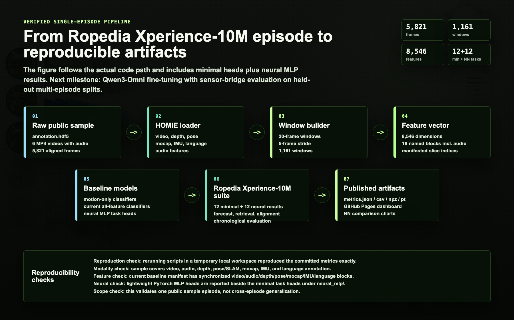

# Ropedia Episode Task Suite

[](https://chaoyue0307.github.io/ropedia-episode-task-suite/)
[](https://github.com/Ropedia)
[](#scope)

A compact, reproducible embodied-AI learning repo built around one public
Ropedia / Xperience-10M sample episode.

This project turns a raw multimodal episode into:

- all-modality sliding-window features,
- motion-only and all-modality baseline models,
- 12 end-to-end episode-level tasks,
- metrics, predictions, model weights, manifests, charts, and a static website,
- a clear explanation of what a single episode can and cannot prove.

Open the polished dashboard:

**https://chaoyue0307.github.io/ropedia-episode-task-suite/**



## Scope

This is a learning, inspection, and pipeline-validation repo. It does **not**
claim cross-episode generalization because the public sample used here is one
episode. The correct next step for real model claims is to run the same suite
over many episodes and split train/test by held-out episode.

## What Is Inside

```text
scripts/
  train_min_action_model.py         # motion/IMU baseline
  train_all_modalities_model.py     # all-modality lightweight baseline
  episode_task_suite.py             # 12 end-to-end task definitions
  generate_visualizations.py        # refreshes SVG charts + summary JSON

results/
  min_action_model/                 # motion-only action baseline artifacts
  min_subtask_model/                # motion-only subtask baseline artifacts
  min_all_modalities_action_model/  # all-modality action artifacts
  min_all_modalities_subtask_model/ # all-modality subtask artifacts
  episode_task_suite/               # 12-task suite metrics and predictions

docs/
  index.html                        # GitHub Pages dashboard
  data/summary_metrics.json         # website-readable metrics bundle
  assets/charts/*.svg               # regenerated visualizations

notes/
  min_action_model.md
  all_modalities_model.md
  episode_task_suite.md
```

Raw Ropedia data is **not** committed. Download it from the original source and
follow the dataset terms.

## Data Expected

The scripts expect a workspace with the Ropedia toolkit and the sample episode:

```text
<workspace>/
  HOMIE-toolkit/
  data/sample/xperience-10m-sample/
    annotation.hdf5
    fisheye_cam0.mp4
    fisheye_cam1.mp4
    fisheye_cam2.mp4
    fisheye_cam3.mp4
    stereo_left.mp4
    stereo_right.mp4
```

The public sample dataset identifier is:

```text
ropedia-ai/xperience-10m-sample
```

## Quickstart

From a workspace folder:

```bash
git clone https://github.com/Ropedia/HOMIE-toolkit.git
python3.12 -m venv .venv
source .venv/bin/activate
pip install -r HOMIE-toolkit/requirements.txt huggingface_hub hf_xet
```

Download the sample:

```bash
hf download ropedia-ai/xperience-10m-sample \
  --repo-type dataset \
  --local-dir data/sample/xperience-10m-sample
```

Clone and run this repo:

```bash
git clone https://github.com/ChaoYue0307/ropedia-episode-task-suite.git
cd ropedia-episode-task-suite
python scripts/episode_task_suite.py --workspace /path/to/workspace
```

Run the smaller baselines:

```bash
python scripts/train_min_action_model.py --workspace /path/to/workspace
python scripts/train_all_modalities_model.py --workspace /path/to/workspace
```

Refresh charts and the website data bundle:

```bash
python scripts/generate_visualizations.py
```

## Key Results

| Experiment | Main score | Accuracy | Notes |
| --- | ---: | ---: | --- |
| Motion-only action | 0.9688 macro-F1 | 0.9828 | Uses motion/IMU features only |
| All-modality action | 0.9791 macro-F1 | 0.9828 | 8,378-dimensional feature vector |
| Motion-only subtask | 0.9528 macro-F1 | 0.9759 | Strong within-episode subtask signal |
| All-modality subtask | 0.9308 macro-F1 | 0.9828 | High accuracy, lower class-balanced score |
| Cross-modal retrieval | 0.3764 top-5 | n/a | Motion/IMU/camera retrieves matching depth/video |
| Transition detection | 0.6552 macro-F1 | 0.9253 | Boundary F1 is 0.2143 |
| Hand trajectory forecast | 0.8223 MPJPE | n/a | Predicts future hand-joint trajectory |

The strongest single-episode self-supervised signal is cross-modal retrieval:
motion/IMU/camera features retrieve matching depth/video windows substantially
better than random.

## Why Some Scores Are Low

The task suite intentionally uses a chronological split:

```text
first 70% of the episode -> train
last 30% of the episode  -> test
```

The test segment contains some action/subtask labels never seen during training.
Timeline and next-action classifiers therefore expose the core limitation of
single-episode learning instead of hiding it behind random splits.

## Modalities Used

The all-modality vector has 8,378 dimensions and includes:

- hand/body mocap joints and contact labels,
- camera translation and rotation,
- IMU acceleration and gyroscope traces,
- depth confidence features,
- six video streams,
- caption/object/interaction text features,
- SLAM point-cloud summary features,
- calibration parameters.

The exact feature block boundaries are stored in
[`results/episode_task_suite/feature_manifest.json`](results/episode_task_suite/feature_manifest.json).

## Data Notice

Ropedia / Xperience-10M data belongs to its original authors and is subject to
the dataset's original license and access terms. This repo contains code and
derived experiment artifacts only; it does not redistribute the raw videos or
raw annotation dataset.
