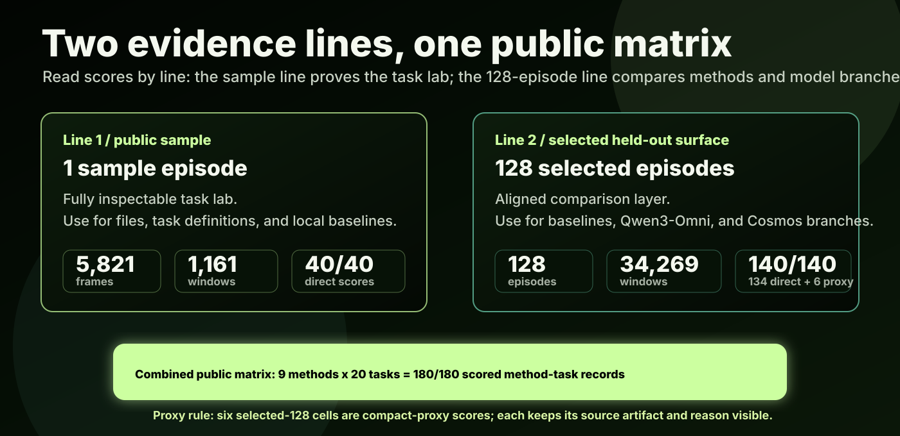
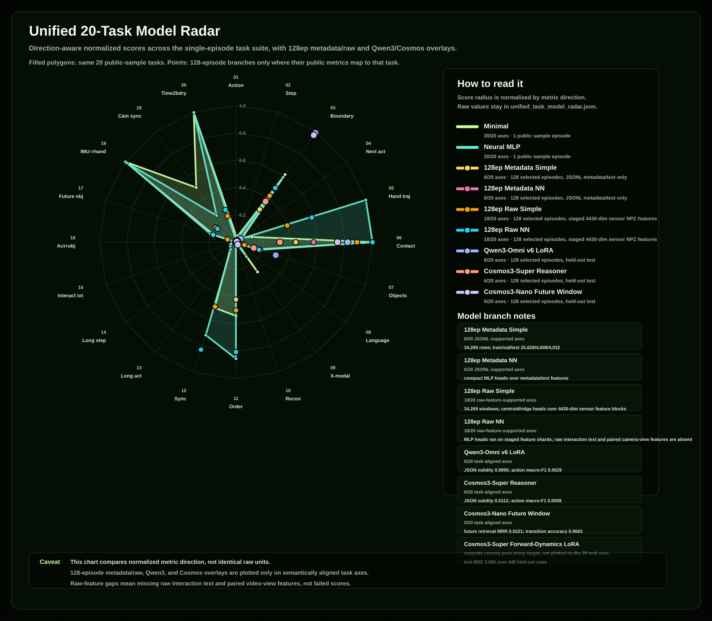
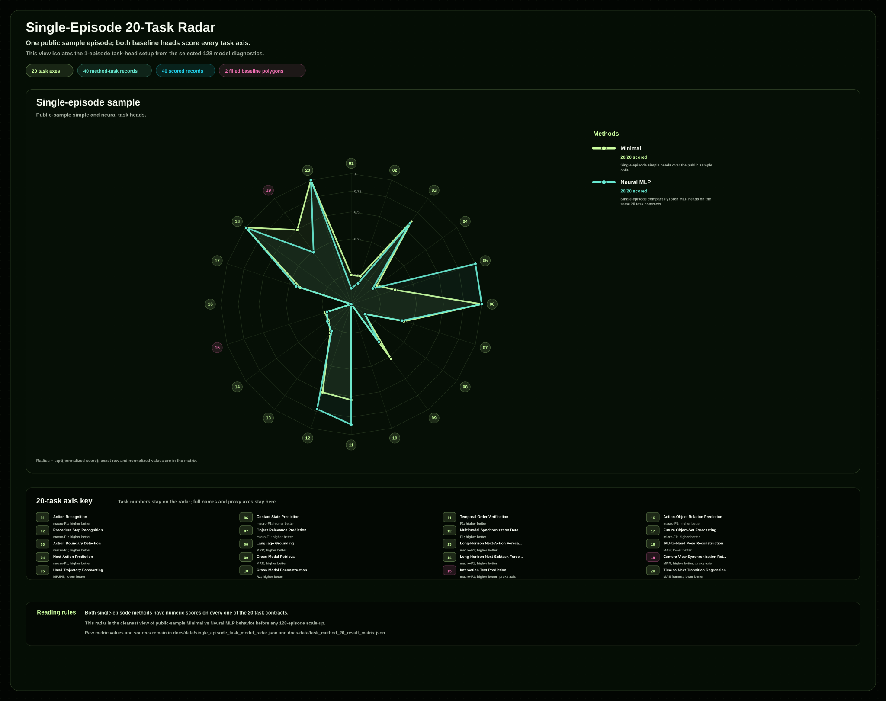
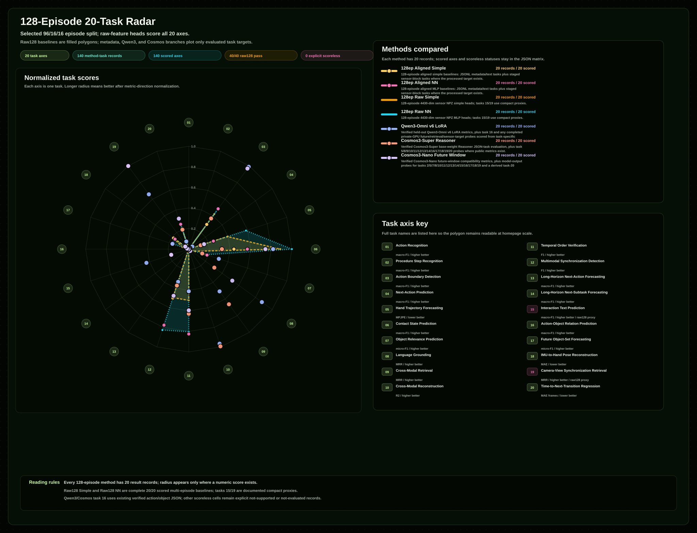
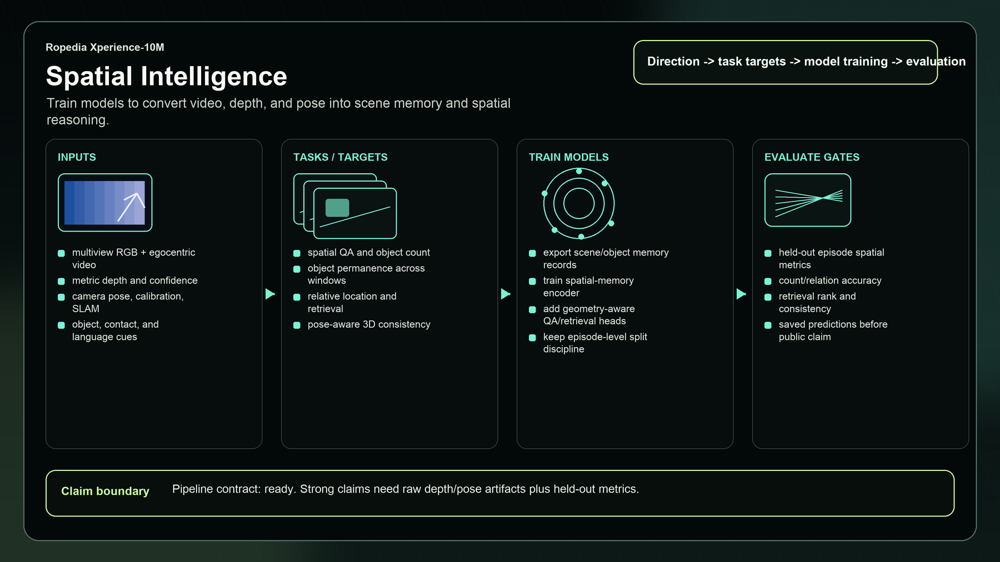
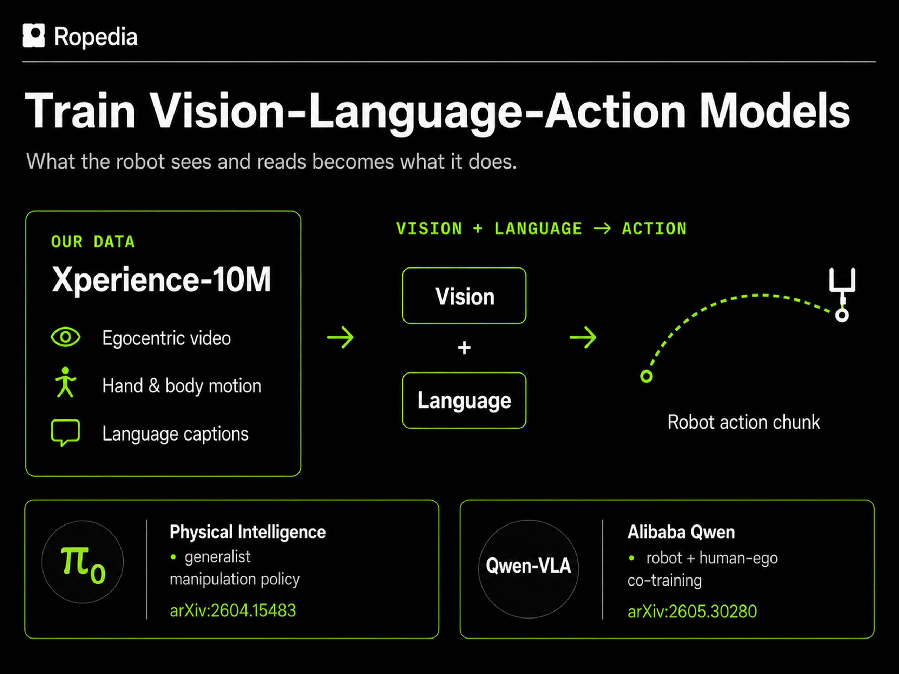
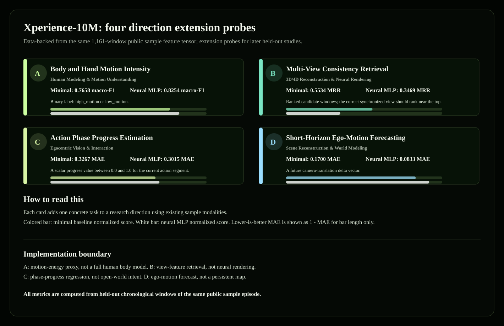

<p align="center">
  
</p>

<h1 align="center">Ropedia Xperience-10M Task Suite</h1>

<p align="center">
  
</p>

<p align="center">
  <strong>A multilingual public research surface for Xperience-10M: sample data, 20 embodied-AI tasks, baselines, Qwen3-Omni and Cosmos3 diagnostics, and foundation-model training directions.</strong>
</p>

<!-- LANG-BAR:START -->
<p align="center">
  <a href="README.md"><b>English</b></a> ·
  <a href="README.zh.md">中文</a> ·
  <a href="README.es.md">Español</a> ·
  <a href="README.fr.md">Français</a> ·
  <a href="README.de.md">Deutsch</a> ·
  <a href="README.ja.md">日本語</a> ·
  <a href="README.ko.md">한국어</a> ·
  <a href="README.pt.md">Português</a>
</p>
<!-- LANG-BAR:END -->

<p align="center">
  <a href="https://chaoyue0307.github.io/ropedia-xperience-10m-task-suite/"></a>
  <a href="https://huggingface.co/spaces/cy0307/ropedia-xperience-10m-task-suite"></a>
  <a href="https://huggingface.co/datasets/cy0307/ropedia-xperience-10m-task-suite-artifacts"></a>
  <a href="https://huggingface.co/cy0307/ropedia-xperience-10m-task-baselines"></a>
  <a href="https://huggingface.co/datasets/ropedia-ai/xperience-10m"></a>
  <a href="LICENSE"></a>
</p>


**Ropedia Xperience-10M Task Suite** has two public evidence lines. **Line 1** is the 1-sample task lab for raw-file inspection, task construction, and reproducibility. **Line 2** is the selected-128 comparison surface for aligned metadata/raw baselines, Qwen3-Omni v6 LoRA, Cosmos3-Super Reasoner, and Cosmos3-Nano Future Window. Every score points to a source artifact and keeps direct-vs-proxy status visible.

**Updated:** 2026-06-21.

**Scope:** Line 1 uses one public sample episode. Line 2 uses selected 128-episode public-safe artifacts linked back to official gated episode paths. Raw Xperience-10M MP4/HDF5/RRD files, Qwen3 base weights, Cosmos3 base weights, and gated data are not redistributed here.

## Contents

- [How To Read This Project](#how-to-read-this-project)
- [At A Glance](#at-a-glance)
- [Two Evidence Lines](#two-evidence-lines)
- [Fast Reader Map](#fast-reader-map)
- [Why This Project Exists](#why-this-project-exists)
- [Start Here](#start-here)
- [Glossary](#glossary)
- [Current Research Scope](#current-research-scope)
- [Evaluation Protocol](#evaluation-protocol)
- [Dataset Context](#dataset-context)
- [Reproducibility](#reproducibility)
- [Citation](#citation)

## How To Read This Project

Use the two evidence lines first, then choose the artifact that answers your question. The dashboard is the best visual overview; the GitHub repo is the source of truth for scripts and generated JSON; Hugging Face mirrors contain public-safe cards, metrics, figures, and model artifacts.

Quick rule: use **Line 1** for “can I inspect and reproduce the task?” Use **Line 2** for “how do aligned baselines and model diagnostics compare on the selected 128 episodes?”

The multilingual README files are reader guides. The canonical technical evidence is still the committed task contracts, result matrices, validation JSON, and public-safe result packages.

## At A Glance

<table>
  <thead>
    <tr>
      <th width="24%">Signal</th>
      <th>Current public state</th>
    </tr>
  </thead>
  <tbody>
    <tr>
      <td><strong>Project identity</strong><br></td>
      <td>The same logo mark is used across the GitHub README, GitHub Pages dashboard, Hugging Face Space, artifact dataset, model mirrors, favicon, and social preview. Reusable assets: <a href="docs/assets/brand/xperience10m-logo-mark-512.png">logo mark</a> and <a href="docs/assets/brand/xperience10m-logo-social-card.png">social card</a>.</td>
    </tr>
    <tr>
      <td><strong>Two-line contract</strong></td>
      <td><strong>Line 1: 1 sample episode</strong> for task construction and reproducibility. <strong>Line 2: 128 selected episodes</strong> for same-split metadata/raw baselines, Qwen3-Omni v6, and Cosmos3 diagnostics.</td>
    </tr>
    <tr>
      <td><strong>180 method-task records</strong></td>
      <td>9 methods x 20 tasks = 180/180 scored records. The ledger separates 174 direct scores from 6 compact-proxy scores.</td>
    </tr>
    <tr>
      <td><strong>20 task contracts</strong></td>
      <td>Action, procedure, transition, trajectory, contact, objects, language, retrieval, reconstruction, order, sync, long-horizon forecasting, interaction text, action-object binding, sensor bridging, camera sync, and transition timing.</td>
    </tr>
    <tr>
      <td><strong>Line 1 methods</strong></td>
      <td>Minimal and Neural MLP baselines cover all 20 tasks on the one public sample episode: 40/40 direct scores.</td>
    </tr>
    <tr>
      <td><strong>Line 2 methods</strong></td>
      <td>Metadata simple/NN, raw-feature simple/NN, Qwen3-Omni v6 LoRA, Cosmos3-Super Reasoner, and Cosmos3-Nano Future Window cover all 20 selected-128 task axes: 140/140 scores.</td>
    </tr>
    <tr>
      <td><strong>Foundation directions</strong></td>
      <td>Spatial intelligence, human-video world modeling, and vision-language-action pipelines are documented as trainable directions with task mappings and model-evidence requirements.</td>
    </tr>
    <tr>
      <td><strong>Public mirrors</strong></td>
      <td>GitHub, GitHub Pages, HF Space, HF artifact dataset, HF baseline model repo, Qwen3-Omni and Cosmos3 model repos, and HF collection.</td>
    </tr>
  </tbody>
</table>

## Two Evidence Lines

The public suite is organized around two evidence lines. Keep them separate when reading metrics.

<p align="center">
  
</p>

<table>
  <thead>
    <tr>
      <th width="20%">Line</th>
      <th width="24%">Data unit</th>
      <th width="22%">Score statement</th>
      <th width="20%">Valid claim</th>
      <th>Do not claim</th>
    </tr>
  </thead>
  <tbody>
    <tr>
      <td><strong>1 sample episode</strong></td>
      <td>One public Xperience-10M sample episode: 5,821 frames, 1,161 aligned 20-frame windows, 8,546 feature dimensions.</td>
      <td>40/40 direct scores from Minimal and Neural MLP heads.</td>
      <td>Task construction, file inspection, local reproducibility, and controlled single-episode baselines.</td>
      <td>Multi-episode generalization.</td>
    </tr>
    <tr>
      <td><strong>128 selected episodes</strong></td>
      <td>Selected held-out 96/16/16 split: 34,269 exported windows with public-safe processed features linked to official gated episode paths. The Hugging Face artifact dataset exposes these rows separately as <a href="https://huggingface.co/datasets/cy0307/ropedia-xperience-10m-task-suite-artifacts/viewer/selected_128_windows/selected_128"><code>selected_128_windows/selected_128</code></a>; it is not mixed with the one-sample <code>episode_sample/public_sample</code> viewer.</td>
      <td>140/140 selected-128 scores: 134 direct + 6 compact-proxy.</td>
      <td>Same-split metadata/raw baseline comparison, Qwen3-Omni v6 diagnostics, Cosmos3 diagnostics, and scale-up planning.</td>
      <td>Reading proxy cells as direct raw-target measurements.</td>
    </tr>
  </tbody>
</table>

### Result Ledger

<table>
  <thead>
    <tr>
      <th width="20%">Line</th>
      <th width="14%">Methods</th>
      <th width="14%">Tasks</th>
      <th width="18%">Scored records</th>
      <th width="16%">Direct scores</th>
      <th>Proxy scores</th>
    </tr>
  </thead>
  <tbody>
    <tr>
      <td><strong>1 sample episode</strong></td>
      <td>2</td>
      <td>20</td>
      <td>40/40</td>
      <td>40</td>
      <td>0</td>
    </tr>
    <tr>
      <td><strong>128 selected episodes</strong></td>
      <td>7</td>
      <td>20</td>
      <td>140/140</td>
      <td>134</td>
      <td>6 compact-proxy scores, each source-linked and reasoned.</td>
    </tr>
    <tr>
      <td><strong>Total public matrix</strong></td>
      <td>9</td>
      <td>20</td>
      <td>180/180</td>
      <td>174</td>
      <td>6</td>
    </tr>
  </tbody>
</table>

### Method Blocks

<table>
  <thead>
    <tr>
      <th width="20%">Evidence line</th>
      <th width="20%">Method block</th>
      <th width="24%">Methods</th>
      <th width="18%">Score statement</th>
      <th>Read as</th>
    </tr>
  </thead>
  <tbody>
    <tr>
      <td><strong>1 sample episode</strong></td>
      <td>Task-head baselines</td>
      <td>Minimal; Neural MLP</td>
      <td>40/40 direct scores.</td>
      <td>Task-lab reproducibility and simple-vs-neural behavior.</td>
    </tr>
    <tr>
      <td><strong>128 selected episodes</strong></td>
      <td>Aligned baseline heads</td>
      <td>Metadata simple/NN; raw-feature simple/NN</td>
      <td>80/80 scores: 74 direct + 6 compact-proxy.</td>
      <td>Same-split metadata/raw-feature baseline comparison.</td>
    </tr>
    <tr>
      <td><strong>128 selected episodes</strong></td>
      <td>Qwen3-Omni series</td>
      <td>Qwen3-Omni v6 LoRA</td>
      <td>20/20 direct scores from verified selected-128 Qwen3-Omni LoRA and task-specific probes.</td>
      <td>Trainable Qwen3-Omni diagnostic baseline on the selected-128 surface.</td>
    </tr>
    <tr>
      <td><strong>128 selected episodes</strong></td>
      <td>Cosmos3 series</td>
      <td>Cosmos3-Super Reasoner; Cosmos3-Nano Future Window</td>
      <td>40/40 direct scores from verified public-safe reasoner and future-window artifacts.</td>
      <td>Cosmos3 reasoner and future-window diagnostics on the selected-128 surface.</td>
    </tr>
  </tbody>
</table>

Cosmos3-Super Forward-Dynamics LoRA is published as a separate fine-tuned adapter artifact with weights/results; it is not counted as a 20-task matrix method row.

### Qwen3-Omni Run Versions

These are Qwen3-Omni run versions inside **Line 2: selected 128 episodes**. They are not the project evidence lines. The 20-task matrix uses **Qwen3-Omni v6 LoRA**; **v5** remains the pinned prior multiscale release; **v1-v4** are lineage and ablation evidence.

<table>
  <thead>
    <tr>
      <th width="8%">Run</th>
      <th width="26%">Purpose</th>
      <th width="28%">Main change</th>
      <th width="16%">Eval signal</th>
      <th>Use now</th>
    </tr>
  </thead>
  <tbody>
    <tr><td><strong>v1</strong></td><td>Prove the selected-128 LoRA/eval/package loop.</td><td>First verified 96/16/16 selected-episode Qwen3-Omni LoRA run.</td><td>448 eval; JSON 0.8750; contact 0.6451.</td><td>Lineage only.</td></tr>
    <tr><td><strong>v2</strong></td><td>Make answers schema-checked.</td><td>Structured-JSON contract with full-8-GPU LoRA on the same split.</td><td>448 eval; JSON 0.9978; contact 0.7188.</td><td>Structured-output ablation.</td></tr>
    <tr><td><strong>v3</strong></td><td>Separate prompt/eval effects from training.</td><td>Strict-label prompt/eval over the v2 adapter; no new adapter training.</td><td>448 eval; JSON 1.0000; contact 0.7210.</td><td>Prompt/eval ablation.</td></tr>
    <tr><td><strong>v4</strong></td><td>Test longer structured-JSON LoRA training.</td><td>New four-epoch full-8-GPU adapter on the same selected split.</td><td>448 eval; JSON 1.0000; contact 0.7299.</td><td>Overfit/metric-tradeoff evidence.</td></tr>
    <tr><td><strong>v5</strong></td><td>Move to denser multiscale evaluation.</td><td>Multiscale cap96 export with 4,032 held-out predictions.</td><td>4,032 eval; JSON 1.0000; contact 0.7865.</td><td>Pinned prior release; stronger on several non-contact metrics.</td></tr>
    <tr><td><strong>v6</strong></td><td>Publish the current Qwen 20-task row.</td><td>Rank64/lr5e-5 multiscale LoRA plus verified task-specific probes.</td><td>4,032 eval; JSON 0.9990; contact 0.8177.</td><td>Current public 20-task Qwen3-Omni row.</td></tr>
  </tbody>
</table>

Detailed lineage:
[`QWEN3_OMNI_RUN_LINEAGE.md`](QWEN3_OMNI_RUN_LINEAGE.md) and
[`qwen3_omni_run_lineage.json`](docs/data/qwen3_omni_run_lineage.json).

Result entry points:
[`TWO_EVIDENCE_LINES.md`](TWO_EVIDENCE_LINES.md),
[`two_evidence_lines.json`](docs/data/two_evidence_lines.json),
[`TWO_EVIDENCE_LINE_RESULT_SUMMARY.md`](TWO_EVIDENCE_LINE_RESULT_SUMMARY.md),
[`two_evidence_line_result_summary.json`](docs/data/two_evidence_line_result_summary.json),
[`QWEN3_OMNI_RUN_LINEAGE.md`](QWEN3_OMNI_RUN_LINEAGE.md),
[`qwen3_omni_run_lineage.json`](docs/data/qwen3_omni_run_lineage.json),
[`single_episode_task_model_radar.json`](docs/data/single_episode_task_model_radar.json),
[`episode128_task_model_radar.json`](docs/data/episode128_task_model_radar.json),
[`task_method_20_result_matrix.json`](docs/data/task_method_20_result_matrix.json), and
[`xperience10m_128_episode_feature_index.json`](docs/data/xperience10m_128_episode_feature_index.json).

## Fast Reader Map

<table>
  <thead>
    <tr>
      <th width="26%">Reader goal</th>
      <th width="32%">Start here</th>
      <th>Then inspect</th>
    </tr>
  </thead>
  <tbody>
    <tr>
      <td><strong>Understand quickly</strong></td>
      <td><a href="PROJECT_BRIEF.md">Project brief</a><br><a href="PROJECT_STATUS.md">Project status</a></td>
      <td><a href="https://chaoyue0307.github.io/ropedia-xperience-10m-task-suite/">Dashboard</a></td>
    </tr>
    <tr>
      <td><strong>Choose the public surface</strong></td>
      <td><a href="PUBLIC_READER_MAP.md">Public reader map</a></td>
      <td><a href="docs/data/public_reader_map.json">public_reader_map.json</a></td>
    </tr>
    <tr>
      <td><strong>Decode project terms</strong></td>
      <td><a href="GLOSSARY.md">Glossary</a></td>
      <td><a href="docs/data/glossary.json">glossary.json</a></td>
    </tr>
    <tr>
      <td><strong>Inspect the 20 tasks</strong></td>
      <td><a href="TASK_SUITE_20.md">TASK_SUITE_20.md</a></td>
      <td><a href="docs/data/task_suite_20.json">task_suite_20.json</a><br><a href="results/episode_task_suite/task_walkthroughs/">task walkthroughs</a></td>
    </tr>
    <tr>
      <td><strong>Compare results</strong></td>
      <td><a href="RESEARCH_TAKEAWAYS.md">Research takeaways</a></td>
      <td><a href="docs/data/two_evidence_line_result_summary.json">two-line result summary</a><br><a href="docs/data/task_method_20_result_matrix.json">180-result matrix</a><br><a href="docs/data/unified_task_model_radar.json">radar JSON</a><br><a href="docs/data/task_method_20_gap_audit.json">score/proxy audit</a></td>
    </tr>
    <tr>
      <td><strong>Understand one sample</strong></td>
      <td><a href="https://chaoyue0307.github.io/ropedia-xperience-10m-task-suite/single_episode_explorer.html">Single-episode explorer</a></td>
      <td><a href="docs/data/raw_sample_files.json">raw sample file map</a><br><a href="results/episode_task_suite/feature_manifest.json">feature manifest</a></td>
    </tr>
    <tr>
      <td><strong>Read foundation directions</strong></td>
      <td><a href="THREE_FOUNDATION_PIPELINES.md">Three foundation pipelines</a></td>
      <td><a href="docs/data/three_foundation_pipelines.json">three_foundation_pipelines.json</a><br><a href="FOUNDATION_MODEL_PLAN.md">foundation model plan</a></td>
    </tr>
    <tr>
      <td><strong>Reproduce or audit</strong></td>
      <td><a href="REPRODUCIBILITY.md">Reproducibility</a><br><a href="EVIDENCE_CONTRACT.md">Evidence contract</a></td>
      <td><a href="docs/data/quality_gates.json">quality gates</a><br><a href="docs/data/publication_audit.json">publication audit</a><br><a href="docs/data/mirror_parity.json">mirror parity</a></td>
    </tr>
  </tbody>
</table>

## Why This Project Exists

This project is organized as a compact research artifact around Xperience-10M:
start from a real public episode, make every modality and label path inspectable,
turn the data into concrete embodied-AI tasks, and keep the evaluation boundary
clear while preparing the next multi-episode experiments. The emphasis is on
research judgment as much as implementation: what the sample can show, what it
cannot show, and what evidence should exist before claiming model quality.

The work is designed to demonstrate four capabilities that matter for
embodied-AI research infrastructure:

<table>
  <thead>
    <tr>
      <th width="26%">Capability</th>
      <th>What this project shows</th>
    </tr>
  </thead>
  <tbody>
    <tr><td><strong>Multimodal data understanding</strong></td><td>Parses the public sample into synchronized windows across video, audio, depth, pose/SLAM, mocap, IMU, calibration, and language-derived signals.</td></tr>
    <tr><td><strong>Task design</strong></td><td>Defines 20 human-readable tasks in one unified public-sample suite, plus four direction-extension probes with inputs, outputs, process modules, metrics, and case-study walkthroughs.</td></tr>
    <tr><td><strong>Model and evaluation discipline</strong></td><td>Runs minimal and compact neural baselines, records predictions/metrics, keeps chronological split boundaries explicit, and separates sample evidence from held-out claims.</td></tr>
    <tr><td><strong>Scale-up planning</strong></td><td>Connects the public-sample pipeline to 32/128-episode held-out pilots, Qwen3-Omni LoRA, Cosmos-style world-model tracks, policy/VLA tracks, and the future Xperience-native foundation-model pretraining goal.</td></tr>
  </tbody>
</table>

## Start Here

The public release is split across GitHub, the website, and Hugging Face. Use
[`PUBLIC_READER_MAP.md`](PUBLIC_READER_MAP.md) first if you want the shortest
route through those surfaces, or use the machine-readable companion
[`docs/data/public_reader_map.json`](docs/data/public_reader_map.json).
For the one-page project summary, use [`PROJECT_BRIEF.md`](PROJECT_BRIEF.md)
and [`docs/data/project_brief.json`](docs/data/project_brief.json).

<table>
  <thead>
    <tr>
      <th width="32%">Reader goal</th>
      <th>Best entry point</th>
    </tr>
  </thead>
  <tbody>
    <tr><td><strong>Choose the right public surface</strong></td><td><a href="PUBLIC_READER_MAP.md">PUBLIC_READER_MAP.md</a><br><a href="docs/data/public_reader_map.json">public_reader_map.json</a></td></tr>
    <tr><td><strong>Resolve confusing terms and abbreviations</strong></td><td><a href="GLOSSARY.md">GLOSSARY.md</a><br><a href="docs/data/glossary.json">glossary.json</a></td></tr>
    <tr><td><strong>Understand the whole project quickly</strong></td><td><a href="PROJECT_BRIEF.md">PROJECT_BRIEF.md</a></td></tr>
    <tr><td><strong>See the visual research dashboard</strong></td><td><a href="https://chaoyue0307.github.io/ropedia-xperience-10m-task-suite/">GitHub Pages dashboard</a></td></tr>
    <tr><td><strong>Navigate the unified 20 tasks, four tracks, and scale-up plan</strong></td><td><a href="https://chaoyue0307.github.io/ropedia-xperience-10m-task-suite/research_roadmap.html">Interactive research roadmap</a><br><a href="TASK_SUITE_20.md">TASK_SUITE_20.md</a><br><a href="docs/data/task_suite_20.json">task_suite_20.json</a><br><a href="docs/data/research_roadmap_interactive.json">research_roadmap_interactive.json</a></td></tr>
    <tr><td><strong>Compare current task metrics</strong></td><td><a href="RESEARCH_TAKEAWAYS.md">RESEARCH_TAKEAWAYS.md</a><br><a href="docs/data/summary_metrics.json">summary_metrics.json</a></td></tr>
    <tr><td><strong>Compare possible foundation backbones</strong></td><td><a href="FOUNDATION_MODEL_PLAN.md">FOUNDATION_MODEL_PLAN.md</a><br><a href="docs/data/foundation_model_plan.json">foundation_model_plan.json</a></td></tr>
    <tr><td><strong>Understand the future native pretraining goal</strong></td><td><a href="XPERIENCE_EMBODIED_FOUNDATION_MODEL_PRETRAINING.md">XPERIENCE_EMBODIED_FOUNDATION_MODEL_PRETRAINING.md</a></td></tr>
    <tr><td><strong>See additional concrete project directions</strong></td><td><a href="ADDITIONAL_DEVELOPMENT_DIRECTIONS.md">ADDITIONAL_DEVELOPMENT_DIRECTIONS.md</a><br><a href="docs/data/additional_development_directions.json">additional_development_directions.json</a></td></tr>
    <tr><td><strong>Understand one model input</strong></td><td><a href="results/episode_task_suite/feature_manifest.json">feature_manifest.json</a><br><a href="results/episode_task_suite/windows.csv">windows.csv</a></td></tr>
    <tr><td><strong>Check multi-episode data status</strong></td><td><a href="results/omni_finetune/DATA_ACCESS_STATUS.md">DATA_ACCESS_STATUS.md</a></td></tr>
  </tbody>
</table>

## Glossary

Use [`GLOSSARY.md`](GLOSSARY.md) when a term such as evidence line,
20-frame window, direct score, compact-proxy score, raw metric value,
normalized radar value, minimal/minimum baseline, simple baseline, Qwen v1-v6,
Cosmos3-Super, LoRA adapter, or HF artifact dataset is unclear. The same definitions are mirrored as
[`docs/data/glossary.json`](docs/data/glossary.json) for the website and
Hugging Face repos.

## Public Surface Map

<table>
  <thead>
    <tr>
      <th width="28%">Surface</th>
      <th>What it is for</th>
    </tr>
  </thead>
  <tbody>
    <tr><td><strong>GitHub repo</strong></td><td>Source of truth for docs, scripts, generated JSON, validators, and commit history.</td></tr>
    <tr><td><strong>GitHub Pages dashboard</strong></td><td>Best visual overview of the sample, 20 tasks, radar results, foundation directions, and resources.</td></tr>
    <tr><td><strong>Hugging Face Space</strong></td><td>Hub-hosted copy of the dashboard and static app assets.</td></tr>
    <tr><td><strong>HF artifact dataset</strong></td><td>Public-safe metrics, reports, website JSON, result packages, and derived evidence files.</td></tr>
    <tr><td><strong>HF baseline model repo</strong></td><td>Minimal/neural baseline weights, figures, metrics, and mirrored task artifacts.</td></tr>
    <tr><td><strong>Qwen3-Omni and Cosmos3 model repos</strong></td><td>Adapter-specific public weights or package cards when Qwen3-Omni v6, Cosmos3-Super, or Cosmos3-Nano runs are verified and publishable.</td></tr>
  </tbody>
</table>

Public release checks are exposed as JSON for mirrors and dashboards:
[`docs/data/website_integrity.json`](docs/data/website_integrity.json),
[`docs/data/rendered_site_check.json`](docs/data/rendered_site_check.json),
[`docs/data/task_surface_integrity.json`](docs/data/task_surface_integrity.json),
[`docs/data/publication_audit.json`](docs/data/publication_audit.json),
[`docs/data/mirror_parity.json`](docs/data/mirror_parity.json),
[`docs/data/public_surface_qa.json`](docs/data/public_surface_qa.json), and
[`docs/data/research_roadmap.json`](docs/data/research_roadmap.json).

## Research Project Overview

<table>
  <thead>
    <tr>
      <th width="22%">Theme</th>
      <th>Current implementation</th>
    </tr>
  </thead>
  <tbody>
    <tr><td><strong>Dataset slice</strong></td><td>One public Xperience-10M sample episode, 5,821 frames, 1,161 windows, and an 8,546-dimensional representation.</td></tr>
    <tr><td><strong>Modalities</strong></td><td>Video, audio, depth, camera pose/SLAM, hand/body mocap, IMU, calibration, and language annotations.</td></tr>
    <tr><td><strong>Task suite</strong></td><td>20 human-readable tasks form one embodied-AI public-sample suite with shared windowing, split discipline, leakage controls, and minimal/neural head pattern.</td></tr>
    <tr><td><strong>Baselines</strong></td><td>Minimal linear/ridge/logistic heads plus compact PyTorch MLP task heads over the same chronological split; companion simple/NN metadata baselines are also aligned to the selected 128-episode 96/16/16 split.</td></tr>
    <tr><td><strong>Research directions</strong></td><td>Task mapping and extension probes for human modeling, 3D/4D reconstruction, egocentric interaction, and world modeling.</td></tr>
    <tr>
      <td><strong>Scale-up path</strong></td>
      <td>
        <ul>
          <li>The selected-episode Qwen3-Omni LoRA v6 diagnostic package is verified on the 96/16/16 split with 34,269 exported windows and 4,032 held-out test predictions.</li>
          <li>v6 improves action macro-F1/contact accuracy versus v5; v5 remains a pinned prior-release row where it is stronger on other metrics.</li>
          <li>Same-split simple/NN metadata and raw-feature baselines are now reported on the unified 20-task axes, with compact-proxy notes retained where a target is derived from public-safe processed artifacts.</li>
          <li>The Qwen result proves the multi-episode export/train/eval/package loop and meets the strict-JSON target, but weak action/subtask metrics make it a baseline for error analysis rather than a strong model.</li>
          <li>Cosmos3 has three verified diagnostics: Nano future-window compatibility, Super base-weight Reasoner evaluation, and Super forward-dynamics LoRA fine-tuning over camera-pose proxy targets.</li>
        </ul>
      </td>
    </tr>
    <tr><td><strong>Public surfaces</strong></td><td>GitHub repo, GitHub Pages dashboard, GHCR static-site package, HF Space, HF artifact dataset, HF baseline-model repo, and HF collection.</td></tr>
  </tbody>
</table>

For the fastest interpretation of the current metrics, start with
[`RESEARCH_TAKEAWAYS.md`](RESEARCH_TAKEAWAYS.md) and
[`docs/data/research_takeaways.json`](docs/data/research_takeaways.json).
They summarize what the public sample results actually show: class shift under
chronological splits, neural gains on dynamics/order/alignment, harder
retrieval/reconstruction probes, and why the next model-quality step needs
held-out episodes.

Current contributions:

- manifested sliding-window features over the currently extracted modalities,
- motion-only and current all-feature baseline models,
- 20 end-to-end episode-level task contracts,
- one shared 20-frame window and chronological split contract across the public-sample task suite,
- lightweight neural MLP heads for the same task contracts,
- a generated four-direction research taxonomy matching the Ropedia job tracks,
- four additional direction-extension probes with minimal and neural baselines,
- human-readable research task cards and an interactive scrub/play walkthrough storyboard for every task,
- an interactive research roadmap connecting 20 tasks, four research tracks, current sample evidence, the Qwen3-Omni scale-up path, and foundation-model track selection,
- a next-milestone track for Qwen3-Omni fine-tuning, Cosmos 3 world modeling, and sensor-bridge evaluation,
- a future pretraining plan for an Xperience Embodied Foundation Model over the full corpus after smaller multi-episode stages prove value,
- metrics, predictions, model weights, manifests, charts, and a two-level
  tabbed static research website,
- a clear explanation of what is implemented now and what moves to the multi-episode stage.

## Current Research Scope

This project is best read as a staged embodied-AI research study:

<table>
  <thead>
    <tr>
      <th width="17%">Layer</th>
      <th width="53%">Current scope</th>
      <th width="30%">Where to start</th>
    </tr>
  </thead>
  <tbody>
    <tr>
      <td><strong>Data understanding</strong></td>
      <td>One public Xperience-10M sample episode is converted into 5,821 frames, 1,161 aligned windows, and an 8,546-dimensional multimodal representation.</td>
      <td><a href="PROJECT_BRIEF.md">PROJECT_BRIEF.md</a><br><a href="PROJECT_STATUS.md">PROJECT_STATUS.md</a></td>
    </tr>
    <tr>
      <td><strong>Task suite</strong></td>
      <td>
        Twenty human-readable tasks cover recognition, prediction, retrieval, reconstruction, synchronization, long-horizon forecasting, interaction text, action-object binding, sensor bridging, camera sync, and transition timing.
        Historical <code>tier2_task_suite</code> artifact paths are kept for link stability, but they are provenance paths inside the same suite.
      </td>
      <td>
        <a href="TASK_SUITE_20.md">TASK_SUITE_20.md</a><br>
        <a href="docs/data/task_suite_20.json">task_suite_20.json</a><br>
        <a href="RESEARCH_TAKEAWAYS.md">RESEARCH_TAKEAWAYS.md</a><br>
        <a href="results/episode_task_suite/summary_report.json">summary_report.json</a><br>
        <a href="results/episode_task_suite/tier2_task_suite/TIER2_TASK_BASELINES.md">TIER2_TASK_BASELINES.md</a>
      </td>
    </tr>
    <tr>
      <td><strong>Baselines</strong></td>
      <td>
        Minimal heads and compact PyTorch MLP heads provide a controlled single-episode comparison on the same chronological split.
        The selected 128-episode setup adds same-split metadata simple/NN baselines for JSON-supported tasks and raw-feature simple/NN baselines on all 20 task axes.
        Tasks 15 and 19 are explicitly marked as compact-proxy completions.
      </td>
      <td>
        <a href="results/episode_task_suite/neural_mlp/">neural_mlp/</a><br>
        <a href="results/omni_finetune/multi_episode_128_task_baselines/BASELINE_ALIGNMENT_REPORT.md">BASELINE_ALIGNMENT_REPORT.md</a><br>
        <a href="results/omni_finetune/a100_128_raw20_task_baselines_complete20_proxy_20260616T091500Z/run_summary_all.json">raw20 run summary</a>
      </td>
    </tr>
    <tr>
      <td><strong>Diagnostics</strong></td>
      <td>Audio contribution, modality ablations, timeline overlays, object labels, and alignment stress tests show which signals are useful and which tasks remain hard.</td>
      <td><a href="results/audio_ablation/AUDIO_ABLATION_SUMMARY.md">AUDIO_ABLATION_SUMMARY.md</a><br><a href="docs/single_episode_explorer.html">single_episode_explorer.html</a></td>
    </tr>
    <tr>
      <td><strong>Scale-up</strong></td>
      <td>
        <ul>
          <li>Qwen3-Omni LoRA v6 is verified on the selected 96/16/16 split with 34,269 exported windows and 4,032 held-out test predictions.</li>
          <li>v6 improves action macro-F1/contact accuracy versus v5; v5 remains a pinned prior-release row because it is stronger on several other metrics.</li>
          <li>Same-split simple/NN metadata baselines are published for JSON-supported axes, and the raw-feature run adds simple/NN baselines on 20/20 task axes.</li>
          <li>Tasks 15 and 19 are documented compact proxies because raw interaction strings and paired video-view embeddings are absent from the 128 export.</li>
          <li>Cosmos3-Nano has a verified future-window compatibility package; Cosmos3-Super has a 448-window base-weight JSON-task Reasoner evaluation.</li>
          <li>Cosmos3-Super also has a fine-tuned forward-dynamics LoRA package over camera-pose proxy targets with 2,848 train rows, 512 validation rows, and 448 test rows.</li>
          <li>The 128-episode enhancement pack records dense-window sizing, hierarchical action/subtask targets, task bottlenecks, and next experiment cards without overwriting existing results.</li>
        </ul>
      </td>
      <td>
        <a href="RESEARCH_ROADMAP.md">RESEARCH_ROADMAP.md</a><br>
        <a href="FOUNDATION_MODEL_PLAN.md">FOUNDATION_MODEL_PLAN.md</a><br>
        <a href="XPERIENCE10M_128_EPISODE_FEATURE_INDEX.md">XPERIENCE10M_128_EPISODE_FEATURE_INDEX.md</a><br>
        <a href="docs/data/xperience10m_128_episode_feature_index.json">xperience10m_128_episode_feature_index.json</a><br>
        <a href="TASK_SUITE_ENHANCEMENT_128.md">TASK_SUITE_ENHANCEMENT_128.md</a><br>
        <a href="docs/data/task_suite_enhancement_128.json">task_suite_enhancement_128.json</a><br>
        <a href="docs/data/omni_model_comparison.json">omni_model_comparison.json</a><br>
        <a href="docs/data/omni_finetune_verified_result.json">omni_finetune_verified_result.json</a><br>
        <a href="docs/data/qwen3_v5_v6_comparison.json">qwen3_v5_v6_comparison.json</a><br>
        <a href="results/omni_finetune/QWEN3_V5_V6_COMPARISON_20260614.md">QWEN3_V5_V6_COMPARISON_20260614.md</a><br>
        <a href="results/omni_finetune/OMNI_MODEL_COMPARISON.md">OMNI_MODEL_COMPARISON.md</a><br>
        <a href="results/omni_finetune/verified_public/">verified_public/</a><br>
        <a href="results/omni_finetune/task_suite_enhancement_128_v1_20260608/">task_suite_enhancement_128_v1_20260608/</a>
      </td>
    </tr>
  </tbody>
</table>

Detailed dataset notes, reproduction checks, and generated JSON reports are
included for readers who want to inspect the implementation, but they are
supporting materials rather than the main reading path. Use
[`ARTIFACT_GUIDE.md`](ARTIFACT_GUIDE.md) when you want the full file map.

Source alignment is tracked in [`SOURCE_ALIGNMENT_AUDIT.md`](SOURCE_ALIGNMENT_AUDIT.md)
and [`docs/data/source_alignment_audit.json`](docs/data/source_alignment_audit.json).
The official gated `ropedia-ai/xperience-10m` card reports `31.9 TB` on the
live HF surface and an `about-1PB` full-scale storage statement; the committed
API-listing snapshot records `12,103 episode folders` as upstream `metadata only`,
not a local raw-data inventory. In other words, those episode folders are
upstream listing metadata only for this project. The public sample remains
`ropedia-ai/xperience-10m-sample` under `cc-by-nc-4.0`, with the `HOMIE Toolkit`
and `Rerun 0.29.0` noted as source tooling. The official responsible-use note
that the data is `limited in diversity` is preserved.

## Project Status

If you only have one minute, use
[`PROJECT_STATUS.md`](PROJECT_STATUS.md) and
[`docs/data/project_status.json`](docs/data/project_status.json).
They give the current research state in one compact table:

<table>
  <thead>
    <tr>
      <th width="28%">Area</th>
      <th>Current decision</th>
    </tr>
  </thead>
  <tbody>
    <tr><td><strong>Public-sample pipeline</strong></td><td>Verified on one public sample episode: 5,821 frames, 1,161 windows, 8,546 dimensions.</td></tr>
    <tr><td><strong>20-task suite</strong></td><td>Verified minimal baselines with committed metrics, predictions, and manifests.</td></tr>
    <tr><td><strong>Neural heads</strong></td><td>Verified compact PyTorch MLP heads over the same task contracts and chronological splits.</td></tr>
    <tr><td><strong>Dataset context</strong></td><td>Official Xperience-10M links, sample-vs-gated-data boundary, modality coverage, and redistribution policy are documented.</td></tr>
    <tr><td><strong>Evaluation protocol</strong></td><td>Verified generated protocol for windowing, split policy, leakage controls, and per-task metrics.</td></tr>
    <tr><td><strong>Website and Hub pages</strong></td><td>Public dashboard, Hugging Face Space, artifact dataset, baseline model repo, and collection use the same project framing and links.</td></tr>
    <tr><td><strong>Qwen3-Omni multi-episode pilot</strong></td><td>Final verified diagnostic result package exists for the selected 96/16/16 episode split; JSON validity meets the target, while action/subtask metrics remain weak.</td></tr>
    <tr><td><strong>Raw data / full Qwen weights</strong></td><td>Raw Xperience-10M data and full Qwen weights are not redistributed.</td></tr>
  </tbody>
</table>

## 90-Second Research Project Path

If you are reading the project cold, open these in order:

<table>
  <thead>
    <tr>
      <th width="6%">Step</th>
      <th width="24%">Question</th>
      <th width="34%">Primary artifacts</th>
      <th>What should be true</th>
    </tr>
  </thead>
  <tbody>
    <tr><td><strong>1</strong></td><td>What is this project?</td><td><a href="PROJECT_BRIEF.md">PROJECT_BRIEF.md</a><br><a href="PROJECT_STATUS.md">PROJECT_STATUS.md</a><br><a href="https://chaoyue0307.github.io/ropedia-xperience-10m-task-suite/">Dashboard</a></td><td>A public-sample Xperience-10M research project with 20 tasks, baselines, and a scale-up plan.</td></tr>
    <tr><td><strong>2</strong></td><td>What data is used?</td><td><a href="XPERIENCE10M_DATASET_CARD_ALIGNMENT.md">Dataset-card alignment</a><br><a href="https://huggingface.co/datasets/ropedia-ai/xperience-10m">Official HF dataset</a><br><a href="https://huggingface.co/datasets/ropedia-ai/xperience-10m-sample">Sample HF dataset</a></td><td>The implemented suite uses one public sample episode; the gated dataset is reserved for selected multi-episode training.</td></tr>
    <tr><td><strong>3</strong></td><td>What does one model input contain?</td><td><a href="results/episode_task_suite/windows.csv">windows.csv</a><br><a href="results/episode_task_suite/feature_manifest.json">feature_manifest.json</a><br><a href="results/episode_task_suite/available_modalities.json">available_modalities.json</a></td><td>Each window is an aligned multimodal unit with video, audio, depth, pose/SLAM, mocap, IMU, calibration, and language-derived signals.</td></tr>
    <tr><td><strong>4</strong></td><td>What are the 20 tasks?</td><td><a href="TASK_SUITE_20.md">TASK_SUITE_20.md</a><br><a href="docs/data/task_suite_20.json">task_suite_20.json</a><br><a href="results/episode_task_suite/task_walkthroughs/">task walkthroughs</a><br><a href="docs/data/task_walkthroughs.json">task_walkthroughs.json</a></td><td>Every task has a human-readable name, input, output, metric, baseline scores, and an explicit artifact path.</td></tr>
    <tr><td><strong>5</strong></td><td>How are tasks evaluated?</td><td><a href="EVALUATION_PROTOCOL.md">EVALUATION_PROTOCOL.md</a><br><a href="docs/data/evaluation_protocol.json">evaluation_protocol.json</a></td><td>The window unit, chronological split, leakage controls, task metrics, and current limitations are explicit.</td></tr>
    <tr><td><strong>6</strong></td><td>What do current results mean?</td><td><a href="RESEARCH_TAKEAWAYS.md">RESEARCH_TAKEAWAYS.md</a><br><a href="docs/data/research_takeaways.json">research_takeaways.json</a><br><a href="docs/data/summary_metrics.json">summary_metrics.json</a></td><td>Current metrics describe sample-level task behavior and identify which signals need larger held-out experiments.</td></tr>
    <tr><td><strong>7</strong></td><td>Which models are implemented?</td><td><a href="results/episode_task_suite/summary_report.json">summary_report.json</a><br><a href="results/episode_task_suite/neural_mlp/">neural_mlp/</a><br><a href="https://huggingface.co/cy0307/ropedia-xperience-10m-task-baselines">HF baseline repo</a></td><td>Each task has minimal and neural-head evidence over the same feature windows.</td></tr>
    <tr><td><strong>8</strong></td><td>What research directions does this support?</td><td><a href="RESEARCH_ROADMAP.md">RESEARCH_ROADMAP.md</a><br><a href="docs/data/research_directions.json">research_directions.json</a><br><a href="docs/data/research_direction_extensions.json">research_direction_extensions.json</a><br><a href="docs/data/task_suite_20.json">task_suite_20.json</a></td><td>The unified tasks are mapped to human modeling, 3D/4D reconstruction, egocentric interaction, and world modeling.</td></tr>
    <tr><td><strong>9</strong></td><td>Which foundation model comes next?</td><td><a href="FOUNDATION_MODEL_PLAN.md">FOUNDATION_MODEL_PLAN.md</a><br><a href="docs/data/foundation_model_plan.json">foundation_model_plan.json</a><br><a href="XPERIENCE_EMBODIED_FOUNDATION_MODEL_PRETRAINING.md">Native pretraining plan</a></td><td>Qwen3-Omni is the first held-out LoRA baseline; Cosmos 3 has Nano compatibility and Super forward-dynamics LoRA; policy models wait for robot-compatible action targets.</td></tr>
    <tr><td><strong>10</strong></td><td>How can the 128-episode suite be pushed without more data?</td><td><a href="TASK_SUITE_ENHANCEMENT_128.md">TASK_SUITE_ENHANCEMENT_128.md</a><br><a href="docs/data/task_suite_enhancement_128.json">task_suite_enhancement_128.json</a></td><td>The enhancement pack proposes dense windows, hierarchical action/subtask labels, raw-feature shard priorities, and <code>multiscale_20s10_40s20_80s40</code> as the next export target.</td></tr>
    <tr><td><strong>11</strong></td><td>How do I reproduce it?</td><td><a href="REPRODUCIBILITY.md">REPRODUCIBILITY.md</a><br><a href="notes/reproducibility_audit.md">reproducibility_audit.md</a></td><td>Public commands and expected outputs are documented for the sample-episode task suite.</td></tr>
    <tr><td><strong>12</strong></td><td>What is still pending?</td><td><a href="docs/data/omni_finetune_verified_result.json">omni_finetune_verified_result.json</a><br><a href="results/omni_finetune/DATA_ACCESS_STATUS.md">DATA_ACCESS_STATUS.md</a><br><a href="results/omni_finetune/MULTI_EPISODE_ACCESS_STATUS.md">MULTI_EPISODE_ACCESS_STATUS.md</a></td><td>The final held-out diagnostic Qwen pass is verified and JSON-validity target is met; strong action/subtask model quality remains pending.</td></tr>
  </tbody>
</table>

A compact reader-path summary is available at
[`docs/data/project_packet.json`](docs/data/project_packet.json).

## Supporting Files

[`ARTIFACT_GUIDE.md`](ARTIFACT_GUIDE.md) is the human-readable map for readers
who want to inspect the project files after the first pass. It groups the main
briefs, task outputs, baseline results, visual assets, data notes, and
scale-up documents.

[`docs/data/artifact_index.json`](docs/data/artifact_index.json) is the compact
machine-readable companion used by the website and Hugging Face artifact
dataset.

## Evaluation Protocol

[`EVALUATION_PROTOCOL.md`](EVALUATION_PROTOCOL.md) and
[`docs/data/evaluation_protocol.json`](docs/data/evaluation_protocol.json) are
generated from committed metric artifacts. They define:

- the 20-frame window unit, stride, feature dimension, and raw-data policy,
- the chronological 70/30 single-episode split and its generalization limit,
- the per-task input, target, primary metric, minimal score, and neural score,
- leakage controls for future labels, target-side signals, caption/object
  labels, and train-only normalization,
- current limitations, including cross-episode generalization,
  audio-visual learning, pixel-depth reconstruction, and real held-out
  multi-episode Qwen3-Omni quality.

## Dataset Context

The official [`ropedia-ai/xperience-10m`](https://huggingface.co/datasets/ropedia-ai/xperience-10m)
dataset is a gated large-scale egocentric multimodal dataset for embodied AI,
robotics, spatial intelligence, and world modeling. The public
[`ropedia-ai/xperience-10m-sample`](https://huggingface.co/datasets/ropedia-ai/xperience-10m-sample)
repo provides the sample episode used for the implemented task suite here.

This project keeps two evidence lines separate. Line 1 uses the public sample
for raw-file inspection, task construction, and local reproducibility. Line 2
uses selected 128-episode public-safe artifacts for same-split method
comparison, Qwen3-Omni v6 diagnostics, and Cosmos3 diagnostics. Raw
Xperience-10M MP4/HDF5/RRD files are not redistributed in this repo or in the
Hugging Face mirrors.

The current verified public-sample subset is:

- one public sample episode, 5,821 frames, and 1,161 aligned windows,
- raw sample files with six MP4 video streams and audio streams,
- `annotation.hdf5` carrying depth, SLAM/camera pose, hand/body mocap, IMU,
  language/caption annotations, calibration, metadata, and timing records,
- an 8,546-dimensional baseline representation using video, audio, depth,
  pose/SLAM, mocap, IMU, calibration, and language-derived signals.

Detailed dataset notes are available in
[`XPERIENCE10M_DATASET_CARD_ALIGNMENT.md`](XPERIENCE10M_DATASET_CARD_ALIGNMENT.md)
and [`docs/data/xperience10m_dataset_card_alignment.json`](docs/data/xperience10m_dataset_card_alignment.json)
for readers who need the full upstream-card and access-term context. The
practical boundary is simple: task-lab claims come from Line 1, selected-128
comparison claims come from Line 2, and compact-proxy cells stay explicitly
marked where direct raw targets are missing.

Start with the visual dashboard:

**[chaoyue0307.github.io/ropedia-xperience-10m-task-suite](https://chaoyue0307.github.io/ropedia-xperience-10m-task-suite/)**

Hugging Face Space app:

**[cy0307-ropedia-xperience-10m-task-suite.hf.space](https://cy0307-ropedia-xperience-10m-task-suite.hf.space/)**

## Read This Project By Evidence View

<table>
  <thead>
    <tr>
      <th width="24%">View</th>
      <th width="34%">What to inspect</th>
      <th>Why it matters</th>
    </tr>
  </thead>
  <tbody>
    <tr><td><strong>Project status</strong></td><td><a href="PROJECT_STATUS.md">PROJECT_STATUS.md</a><br><a href="docs/data/project_status.json">project_status.json</a></td><td>Gives a one-table current project summary before reading the full artifact trail.</td></tr>
    <tr><td><strong>Data contract</strong></td><td><a href="results/episode_task_suite/windows.csv">windows.csv</a><br><a href="results/episode_task_suite/feature_manifest.json">feature_manifest.json</a><br>modality manifests</td><td>Confirms what each sample window contains before modeling.</td></tr>
    <tr><td><strong>Dataset context</strong></td><td><a href="XPERIENCE10M_DATASET_CARD_ALIGNMENT.md">XPERIENCE10M_DATASET_CARD_ALIGNMENT.md</a><br>official dataset links</td><td>Explains the official dataset, public sample, modalities, access boundary, and what this repo uses.</td></tr>
    <tr><td><strong>Visual assets</strong></td><td><a href="FIGURE_INDEX.md">FIGURE_INDEX.md</a><br><a href="docs/assets/">docs/assets/</a></td><td>Shows the task-suite graphic, modality thumbnails, pipeline diagrams, charts, and logo assets.</td></tr>
    <tr><td><strong>Evaluation protocol</strong></td><td><a href="EVALUATION_PROTOCOL.md">EVALUATION_PROTOCOL.md</a><br><a href="docs/data/evaluation_protocol.json">evaluation_protocol.json</a></td><td>Defines the task unit, split, metrics, leakage controls, and current limitations.</td></tr>
    <tr><td><strong>Research roadmap</strong></td><td><a href="RESEARCH_ROADMAP.md">RESEARCH_ROADMAP.md</a><br><a href="docs/data/research_roadmap.json">research_roadmap.json</a></td><td>Shows the path from sample-level task development to multi-episode work, larger model tracks, and the future native-pretraining goal.</td></tr>
    <tr><td><strong>Additional development directions</strong></td><td><a href="ADDITIONAL_DEVELOPMENT_DIRECTIONS.md">ADDITIONAL_DEVELOPMENT_DIRECTIONS.md</a><br><a href="docs/data/additional_development_directions.json">additional_development_directions.json</a></td><td>Records concrete non-backbone tracks: taxonomy, benchmark protocol, representation learning, skill graphs, affordances, 3D/4D memory, QA, and policy transfer.</td></tr>
    <tr><td><strong>Xperience Embodied Foundation Model plan</strong></td><td><a href="XPERIENCE_EMBODIED_FOUNDATION_MODEL_PRETRAINING.md">XPERIENCE_EMBODIED_FOUNDATION_MODEL_PRETRAINING.md</a></td><td>Describes the long-term full-corpus pretraining goal, target modules, objectives, staged scale-up, hardware ranges, and evaluation protocol.</td></tr>
    <tr><td><strong>Minimal heads</strong></td><td>softmax<br>ridge projection/regression<br>multi-label logistic heads</td><td>Keeps every input/output contract visible and inspectable.</td></tr>
    <tr><td><strong>Neural heads</strong></td><td>PyTorch MLP classifiers/regressors under <a href="results/episode_task_suite/neural_mlp/">neural_mlp/</a></td><td>Checks whether nonlinear heads improve each task without changing features.</td></tr>
    <tr><td><strong>Evidence</strong></td><td>metrics<br>predictions<br>confusion matrices<br>diagrams<br>dashboard</td><td>Makes the single-episode task development inspectable without rerunning first.</td></tr>
    <tr><td><strong>Artifact guide</strong></td><td><a href="ARTIFACT_GUIDE.md">ARTIFACT_GUIDE.md</a></td><td>Groups the public evidence into reader-facing views after the first-pass overview.</td></tr>
    <tr><td><strong>Reproducibility contract</strong></td><td><a href="REPRODUCIBILITY.md">REPRODUCIBILITY.md</a><br><a href="docs/data/reproducibility_matrix.json">reproducibility_matrix.json</a></td><td>States public commands, expected outputs, exact-match reproduction evidence, and non-reproducible boundaries.</td></tr>
    <tr><td><strong>Citation metadata</strong></td><td><a href="CITATION.cff">CITATION.cff</a><br><a href="codemeta.json">codemeta.json</a><br><a href="LICENSE">LICENSE</a></td><td>Makes the repo easier to cite, index, and reuse without confusing code license and dataset terms.</td></tr>
  </tbody>
</table>

## Links

<table>
  <thead>
    <tr>
      <th width="34%">Resource</th>
      <th>Link</th>
    </tr>
  </thead>
  <tbody>
    <tr><td><strong>This GitHub repo</strong></td><td><a href="https://github.com/ChaoYue0307/ropedia-xperience-10m-task-suite">github.com/ChaoYue0307/ropedia-xperience-10m-task-suite</a></td></tr>
    <tr><td><strong>This project website</strong></td><td><a href="https://chaoyue0307.github.io/ropedia-xperience-10m-task-suite/">chaoyue0307.github.io/ropedia-xperience-10m-task-suite</a></td></tr>
    <tr><td><strong>This Hugging Face Space</strong></td><td><a href="https://huggingface.co/spaces/cy0307/ropedia-xperience-10m-task-suite">huggingface.co/spaces/cy0307/ropedia-xperience-10m-task-suite</a></td></tr>
    <tr><td><strong>Live Hugging Face app</strong></td><td><a href="https://cy0307-ropedia-xperience-10m-task-suite.hf.space/">cy0307-ropedia-xperience-10m-task-suite.hf.space</a></td></tr>
    <tr><td><strong>GitHub Container package</strong></td><td><a href="https://github.com/ChaoYue0307/ropedia-xperience-10m-task-suite/pkgs/container/ropedia-xperience-10m-task-suite">ghcr.io/chaoyue0307/ropedia-xperience-10m-task-suite</a></td></tr>
    <tr><td><strong>Derived artifacts on Hugging Face</strong></td><td><a href="https://huggingface.co/datasets/cy0307/ropedia-xperience-10m-task-suite-artifacts">huggingface.co/datasets/cy0307/ropedia-xperience-10m-task-suite-artifacts</a></td></tr>
    <tr><td><strong>Minimal and neural task baselines on Hugging Face</strong></td><td><a href="https://huggingface.co/cy0307/ropedia-xperience-10m-task-baselines">huggingface.co/cy0307/ropedia-xperience-10m-task-baselines</a></td></tr>
    <tr><td><strong>Consolidated weights, results, and analysis package</strong></td><td><a href="https://huggingface.co/cy0307/ropedia-xperience-10m-weights-results">huggingface.co/cy0307/ropedia-xperience-10m-weights-results</a></td></tr>
    <tr><td><strong>Qwen3-Omni 128-episode LoRA adapter</strong></td><td><a href="https://huggingface.co/cy0307/ropedia-qwen3-omni-lora-128ep">huggingface.co/cy0307/ropedia-qwen3-omni-lora-128ep</a></td></tr>
    <tr><td><strong>Cosmos3-Super forward-dynamics LoRA adapter</strong></td><td><a href="https://huggingface.co/cy0307/ropedia-cosmos3-super-forward-dynamics-lora-128ep">huggingface.co/cy0307/ropedia-cosmos3-super-forward-dynamics-lora-128ep</a></td></tr>
    <tr><td><strong>Hugging Face collection</strong></td><td><a href="https://huggingface.co/collections/cy0307/ropedia-xperience-10m-task-suite">huggingface.co/collections/cy0307/ropedia-xperience-10m-task-suite</a></td></tr>
    <tr><td><strong>Xperience-10M dataset website</strong></td><td><a href="https://ropedia.com/dataset">ropedia.com/dataset</a></td></tr>
    <tr><td><strong>Xperience-10M release page</strong></td><td><a href="https://ropedia.com/blog/20260316_xperience_10m">ropedia.com/blog/20260316_xperience_10m</a></td></tr>
    <tr><td><strong>Ropedia GitHub organization</strong></td><td><a href="https://github.com/Ropedia">github.com/Ropedia</a></td></tr>
    <tr><td><strong>HOMIE Toolkit</strong></td><td><a href="https://github.com/Ropedia/HOMIE-toolkit">github.com/Ropedia/HOMIE-toolkit</a></td></tr>
    <tr><td><strong>Xperience-10M Hugging Face dataset</strong></td><td><a href="https://huggingface.co/datasets/ropedia-ai/xperience-10m">huggingface.co/datasets/ropedia-ai/xperience-10m</a></td></tr>
    <tr><td><strong>Xperience-10M sample on Hugging Face</strong></td><td><a href="https://huggingface.co/datasets/ropedia-ai/xperience-10m-sample">huggingface.co/datasets/ropedia-ai/xperience-10m-sample</a></td></tr>
    <tr><td><strong>Ropedia Hugging Face organization</strong></td><td><a href="https://huggingface.co/ropedia-ai">huggingface.co/ropedia-ai</a></td></tr>
  </tbody>
</table>

## Citation, License, And Metadata

Use [`CITATION.cff`](CITATION.cff) when citing this project. The repository
also includes [`codemeta.json`](codemeta.json) for machine-readable software
metadata and [`docs/data/project_manifest.json`](docs/data/project_manifest.json)
for website/Hugging Face surface metadata.

The code files are MIT-licensed. Raw Xperience-10M data is not redistributed
here, and dataset use remains governed by the official Ropedia/Xperience-10M
terms. See [`LICENSE`](LICENSE) and [`DATA_NOTICE.md`](DATA_NOTICE.md).


The infographic uses a custom text-free research background and puts the shared
processing contract plus all 20 unified task families in one figure. Public
sample stream thumbnails remain available through the raw sample browser and
derived modality assets instead of a separate repeated atlas panel. The task
names, input/output summaries, and metrics are overlaid from
[`results/episode_task_suite/summary_report.json`](results/episode_task_suite/summary_report.json)
with [`scripts/render_task_suite_infographic.py`](scripts/render_task_suite_infographic.py),
so the published PNG is a presentation graphic with verified labels and metrics,
not a hallucinated metric sheet.

The complete unified task list is documented in [`TASK_SUITE_20.md`](TASK_SUITE_20.md)
and [`docs/data/task_suite_20.json`](docs/data/task_suite_20.json). Historical
`tier2_task_suite` paths remain only as stable provenance links inside the same
suite.



The unified radar is now a grouped small-multiple comparison board instead of a
nine-method overlay. It keeps all 20 task axes and all 9 method rows visible,
but separates the methods into single-episode, 128-episode metadata/text,
128-episode raw-feature, and foundation-model panels. Every method has 20
explicit result records in the public matrix. Tasks 15 and 19 are marked as
compact-proxy completions where the 128 export lacks raw interaction strings or
paired video-view embeddings; those six proxy cells stay explicitly marked
instead of being blended into direct-target metrics. The SVG uses
`sqrt(normalized_score)` only for visual radius so small but real differences
are readable; raw metrics and exact linear normalized scores remain in JSON and
the table.
Cosmos3-Super forward-dynamics LoRA
remains a separate artifact card because its camera-pose proxy MSE is not one of
the 20 task metrics.
The machine-readable copies are
[`docs/data/unified_task_model_radar.json`](docs/data/unified_task_model_radar.json)
and
[`docs/data/task_method_20_result_matrix.json`](docs/data/task_method_20_result_matrix.json);
the explicit score/proxy ledger is
[`docs/data/task_method_20_gap_audit.json`](docs/data/task_method_20_gap_audit.json)
and [`TASK_METHOD_20_GAP_AUDIT.md`](TASK_METHOD_20_GAP_AUDIT.md);
the reader-facing matrix is
[`TASK_METHOD_20_RESULT_MATRIX.md`](TASK_METHOD_20_RESULT_MATRIX.md).
The website Results section also renders the same 180 cells as a wide,
source-linked table with raw values, normalized radar values, metric keys, and
direct/proxy badges.

For easier reading, the same source data is also split into two focused radars:





The single-episode radar uses one enlarged panel for Minimal vs Neural MLP, both
with 20/20 scored public-sample axes. The 128-episode radar uses three grouped
panels for metadata/text baselines, raw-feature baselines, and foundation-model
rows: metadata and raw-feature simple/NN baselines are now complete 20/20
multi-episode records, and Qwen3-Omni v6 LoRA, Cosmos3-Super Reasoner, and
Cosmos3-Nano Future Window each carry 20 scored task records. The current matrix
has 180/180 scored method-task records.

The website raw sample browser includes a concise stream-to-feature ledger
backed by [`docs/data/modality_atlas.json`](docs/data/modality_atlas.json) and
[`docs/assets/modalities/`](docs/assets/modalities/). Those assets are small
derived thumbnails from the public sample, not raw Xperience-10M files.


The pipeline and architecture figures use the same pattern: text-free visual
backgrounds carry the composition, while
[`scripts/render_overview_figures.py`](scripts/render_overview_figures.py)
overlays exact labels, dimensions, and metrics from the committed result files.

## Scope

This is a learning, inspection, and pipeline-validation repo with two public
evidence lines. Line 1 is built from one public sample episode. Line 2 uses a
selected 96/16/16 split over 128 episode paths, public-safe processed features,
and verified Qwen3-Omni/Cosmos3 diagnostic artifacts.

## What Is Inside

```text
scripts/
  train_min_action_model.py         # motion/IMU baseline
  train_all_modalities_model.py     # current all-feature lightweight baseline
  episode_task_suite.py             # public-sample task definitions
  neural_task_models.py             # optional PyTorch MLP heads for task contracts
  research_direction_taxonomy.py    # maps walkthrough-backed tasks to the four research tracks
  research_direction_extension_tasks.py # one extra data-backed probe per track
  tier2_task_suite.py              # historical-name provenance builder for unified task rows
  build_unified_task_suite.py       # builds TASK_SUITE_20.md and task_suite_20.json
  build_unified_task_model_radar.py # builds grouped 20-axis model comparison radars
  build_task_method_20_gap_audit.py # builds the explicit 180/180 scored-cell ledger
  task_walkthroughs.py              # human-readable task-card and walkthrough-storyboard metadata
  generate_visualizations.py        # refreshes SVG charts + summary JSON
  render_task_suite_infographic.py  # renders the task-suite presentation PNG
  export_modality_atlas_assets.py   # exports responsive modality-card assets
  render_overview_figures.py        # renders polished pipeline/architecture PNGs
  build_brand_assets.py             # derives logo sizes, favicon, social card
  build_artifact_index.py           # builds the compact artifact guide data
  build_quality_gates.py            # builds release checks
  validate_mirror_parity.py         # checks prepared GitHub/HF mirror file parity
  validate_scope_claims.py          # separates setup artifacts from completed model metrics
  validate_task_surface.py          # checks readable task cards and interactive storyboard wiring
  validate_website_integrity.py     # checks local site links, anchors, and images
  validate_publication_package.py   # checks public repo + HF bundle contents
  publish_hf_bundles.py             # uploads prepared HF Space/artifact/model bundles
  omni/
    download_sample_modelscope.py   # ModelScope sample download helper
    build_episode_manifest.py       # metadata-only multi-episode scanner
    plan_finetune_sample_budget.py  # storage/sample-count planner
    qwen3_omni_adapter_smoke.py     # real-data Qwen3-Omni adapter setup check
    score_existing_model_output_task_probes.py # scores task targets already present in verified model outputs
    collect_qwen3_v4_release_artifacts.py # pulls verified v4 results after remote eval

results/
  min_action_model/                 # motion-only action baseline artifacts
  min_subtask_model/                # motion-only subtask baseline artifacts
  min_all_modalities_action_model/  # current all-feature action artifacts
  min_all_modalities_subtask_model/ # current all-feature subtask artifacts
  episode_task_suite/               # task-suite metrics and predictions
    neural_mlp/                     # optional neural baseline artifacts per task
    research_directions/            # four-track taxonomy, CSV, and summary
    research_direction_extensions/  # four extra direction probes + predictions
    tier2_task_suite/               # provenance baseline tasks + predictions; historical path
    task_walkthroughs/              # case-study walkthroughs for walkthrough-backed tasks
  omni_exploration/                 # ModelScope readiness-check artifacts
  omni_finetune/model_output_task_probes_20260616/ # task-13/task-16 probes derived from verified model JSON

docs/
  index.html                        # GitHub Pages dashboard
  data/additional_development_directions.json # concrete non-backbone project directions
  data/summary_metrics.json         # website-readable metrics bundle
  data/task_suite_20.json           # unified 20-task suite bundle
  data/unified_task_model_radar.json # 20-task radar values, groups, and sources
  data/single_episode_task_model_radar.json # 1-episode grouped radar values
  data/episode128_task_model_radar.json # 128-episode grouped radar values
  data/task_method_20_result_matrix.json # 9-method x 20-task result matrix
  data/task_method_20_gap_audit.json # explicit 180/180 scored-cell ledger
  data/evidence_contract.json       # machine-readable project scope
  data/artifact_index.json          # compact project-artifact catalog
  data/live_publication_status.json # live GitHub/HF publication verification
  data/quality_gates.json           # machine-readable release checks
  data/task_suite_enhancement_128.json # no-new-episode 128-suite enhancement pack
  data/task_surface_integrity.json  # machine-readable task-card/storyboard integrity check
  data/project_manifest.json        # machine-readable public-surface metadata
  data/project_packet.json          # compact project path and scope summary
  data/research_roadmap.json        # multi-episode and omni-model roadmap
  data/research_directions.json     # four-track website data bundle
  data/research_direction_extensions.json # four extra probe data bundle
  data/tier2_task_suite.json       # provenance baseline bundle; historical path
  data/task_walkthroughs.json       # human-readable task-card and walkthrough-storyboard data
  data/modality_atlas.json          # responsive modality-card data
  assets/brand/*.png                # project logo, favicon, social card
  assets/task_suite_infographic.png # task-suite presentation graphic
  assets/modalities/                # public-sample derived modality thumbnails
  assets/pipeline_diagram.png       # verified episode pipeline graphic
  assets/qwen3_omni_lora_pipeline.png # Qwen3-Omni LoRA training-flow figure
  assets/task_architectures.png     # verified task-head architecture map
  assets/charts/unified_task_model_radar.svg # 9-method grouped small-multiple radar board
  assets/charts/single_episode_task_model_radar.svg # 1-episode enlarged radar panel
  assets/charts/episode128_task_model_radar.svg # 128-episode grouped radar panels
  assets/charts/*.svg               # regenerated visualizations

notes/
  min_action_model.md
  all_modalities_model.md
  episode_task_suite.md
```

Raw Xperience-10M data is **not** committed. Download it from the official
Ropedia distribution and follow the dataset terms.

## GitHub Package

The public dashboard is packaged as a static-site container on GitHub Container
Registry. It contains the `docs/` site plus the main reader documents; it does
not include raw Xperience-10M videos, raw annotations, gated data, or model
weights.

```bash
docker pull ghcr.io/chaoyue0307/ropedia-xperience-10m-task-suite:latest
docker run --rm -p 8080:80 ghcr.io/chaoyue0307/ropedia-xperience-10m-task-suite:latest
```

Then open `http://localhost:8080`.

## Data Expected

The scripts expect a workspace with the Ropedia HOMIE toolkit and the
Xperience-10M sample episode:

```text
<workspace>/
  HOMIE-toolkit/
  data/sample/xperience-10m-sample/
    annotation.hdf5
    fisheye_cam0.mp4
    fisheye_cam1.mp4
    fisheye_cam2.mp4
    fisheye_cam3.mp4
    stereo_left.mp4
    stereo_right.mp4
```

The public website also includes a Raw Sample Browser that lists every official
sample file, plays compact browser-preview clips derived from the official MP4
streams, exposes the audio track embedded in `fisheye_cam0.mp4`, links the full
raw Hugging Face source for each MP4/HDF5/RRD file, and describes the
`annotation.hdf5` group organization without copying large raw files into this
repository.

The public sample dataset identifier is:

```text
ropedia-ai/xperience-10m-sample
```

Hugging Face URL:

```text
https://huggingface.co/datasets/ropedia-ai/xperience-10m-sample
```

## Quickstart

From a workspace folder:

```bash
git clone https://github.com/Ropedia/HOMIE-toolkit.git
python3.12 -m venv .venv
source .venv/bin/activate
pip install -r HOMIE-toolkit/requirements.txt huggingface_hub hf_xet
```

Download the sample:

```bash
hf download ropedia-ai/xperience-10m-sample \
  --repo-type dataset \
  --local-dir data/sample/xperience-10m-sample
```

If Hugging Face access is unavailable in your environment, use ModelScope:

```bash
python scripts/omni/download_sample_modelscope.py \
  --output-dir data/sample/xperience-10m-sample \
  --mode minimal
```

`--mode minimal` downloads `annotation.hdf5`, `README.md`, and
`fisheye_cam0.mp4`. Use `--mode all-training` to add all six MP4 streams while
still skipping `visualization.rrd`.

Clone and run this repo:

```bash
git clone https://github.com/ChaoYue0307/ropedia-xperience-10m-task-suite.git
cd ropedia-xperience-10m-task-suite
python scripts/episode_task_suite.py --workspace /path/to/workspace
```

Run the public-sample task definitions with lightweight neural heads:

```bash
pip install torch
python scripts/episode_task_suite.py \
  --workspace /path/to/workspace \
  --include-neural
```

Then rebuild the unified 20-task index after the historical provenance bundle is regenerated:

```bash
python scripts/tier2_task_suite.py --workspace /path/to/workspace
python scripts/build_unified_task_suite.py
python scripts/build_evaluation_protocol.py
```

Run the smaller baselines:

```bash
python scripts/train_min_action_model.py --workspace /path/to/workspace
python scripts/train_all_modalities_model.py --workspace /path/to/workspace
```

## Xperience-10M Fine-Tuning Exploration

This repo includes a first Qwen3-Omni fine-tuning path over Xperience-10M. The
repository separates public-sample evidence from multi-episode fine-tuning
artifacts. The selected-episode held-out package is now verified as a
diagnostic result, not a strong final action/subtask model.
The useful distinction is:

- direct Qwen3-Omni inputs: RGB/fisheye video, embedded MP4 audio, and language
  prompts,
- adapter-required Xperience-10M sensor inputs: depth, pose/SLAM, hand/body
  mocap, contacts, and IMU.


The figure shows the intended end-to-end training flow: raw valid episodes enter
episode-level split validation, parallel media/sensor export creates Qwen-style
JSONL records, Qwen3-Omni receives video/audio/text directly, the sensor bridge
adds depth/pose/mocap/IMU features, LoRA adapters are trained on prepared
train/val episodes, and sealed held-out test evaluation produces predictions,
metrics, run reports, and upload-ready adapter artifacts.

The scale-up path requires valid prepared episodes, held-out episode splits,
training metadata, predictions, metrics, and a run report. A result is ready
for public README, website, or Hugging Face updates only after the validator
passes and `scripts/omni/package_verified_omni_result.py` creates a
public-safe derived-artifact package. The current verified package is listed in
[`docs/data/omni_finetune_verified_result.json`](docs/data/omni_finetune_verified_result.json).
The current cross-version comparison is generated at
[`docs/data/omni_model_comparison.json`](docs/data/omni_model_comparison.json)
and [`results/omni_finetune/OMNI_MODEL_COMPARISON.md`](results/omni_finetune/OMNI_MODEL_COMPARISON.md);
it separates the single-episode task suite, 128-episode aligned simple/NN
baselines, Qwen3-Omni v6 LoRA, Cosmos3-Super Reasoner, and Cosmos3-Nano Future Window packages. The same generated
files also include `model_groups`: a model-first view that pairs 1-episode and
128-episode entries for the same family. Use that section when comparing task
heads against task heads, Qwen3-Omni smoke/LoRA against Qwen3-Omni LoRA, or
Cosmos3-Nano compatibility against future Cosmos weight releases. For
Qwen3-Omni specifically, read `QWEN3_OMNI_RUN_LINEAGE.md`: v1-v4 are
pipeline-hardening and ablation evidence, v5 is the pinned prior multiscale
release, and v6 is the current public 20-task Qwen row.

The no-new-episode enhancement plan is recorded in
[`docs/data/task_suite_enhancement_128.json`](docs/data/task_suite_enhancement_128.json)
and [`TASK_SUITE_ENHANCEMENT_128.md`](TASK_SUITE_ENHANCEMENT_128.md). It keeps
the current Qwen3-Omni v6 and Cosmos3 packages as baselines, then defines dense-window
scenarios, hierarchical action/subtask targets, task bottlenecks, and experiment
cards for stronger selected-128 runs without overwriting earlier results.

### Sample Count Decision

Do not treat "10M" as a reason to start with the entire dataset. The engineering
unit that matters first is diverse held-out episodes, not adjacent windows from
one session.

| Phase | Episodes/samples | Approx windows at stride 5 | Purpose |
| --- | ---: | ---: | --- |
| Readiness | 1-3 | 1k-3k | Verify loaders, token alignment, and task heads |
| Pilot | 16-32 | 18k-37k | First held-out-episode evaluation |
| Useful LoRA run | 64-128 | 74k-149k | Train sensor adapters plus selected Qwen3-Omni LoRA |
| Storage-heavy run | 256+ | 297k+ | Only after download layout and checkpoint size are stable |

Use the budget helper before downloading:

```bash
python scripts/omni/plan_finetune_sample_budget.py \
  --storage-root /path/to/storage \
  --target-free-after-download-gb 800 \
  --all-training-per-episode-gb 2.4 \
  --full-preview-per-episode-gb 5.1
```

### Multi-Episode Readiness Gate

```bash
python scripts/omni/discover_xperience10m_sources.py \
  --workspace /path/to/ropedia-xperience-10m-task-suite \
  --data-root /path/to/xperience10m_data \
  --output results/omni_finetune/source_discovery.json
```

Current status in this repo:

- public_sample_valid_episodes: 1 (degraded-valid: annotation + fisheye_cam0.mp4)
- gated_metadata_audit: 12,102 complete visible episodes across 802 complete sessions
- selected_episode_plan: 128 source-balanced episodes, 96/16/16 train/val/test
- selected_download_size: 277.71 GiB excluding `visualization.rrd`
- selected_source_feature_index: `XPERIENCE10M_128_EPISODE_FEATURE_INDEX.md` and `docs/data/xperience10m_128_episode_feature_index.json`
- processed_128_feature_artifacts: 34,269 Qwen3-Omni v6 multiscale windows, 106,095 dense multiscale compact rows, and 34,269 x 394 metadata/text matrix rows, all linked back to official gated `ropedia-ai/xperience-10m` episode paths
- verified_final_diagnostic_package: true
- selected_split: 96 train / 16 validation / 16 held-out test episodes
- exported_windows: 2,848 train / 512 validation / 448 test
- validation_samples_used: 512
- held_out_eval: 448 test windows from 14 exported test episodes
- final_train_loss / final_val_loss: 0.0277 / 0.0278
- current_quality_target: strict-label JSON validity 100.00%, meeting the 98% target; action/subtask quality remains weak
- qwen3_lora_adapter_repo: https://huggingface.co/cy0307/ropedia-qwen3-omni-lora-128ep
- cosmos3_super_lora_adapter_repo: https://huggingface.co/cy0307/ropedia-cosmos3-super-forward-dynamics-lora-128ep
- 128_aligned_baselines: unified 20-task axes for simple and neural baselines, including metadata/text rows and public-safe compact-proxy rows where raw-feature targets are required
- cosmos3_nano: verified Cosmos3-Nano future-window compatibility package, 378 held-out future-window predictions from 14 test episodes
- cosmos3_super_reasoner: verified Cosmos3-Super Reasoner base-weight JSON-task evaluation, 448 held-out predictions from 14 test episodes; JSON validity 51.12%, action macro-F1 0.0008, contact accuracy 32.14%, transition accuracy 36.83%
- cosmos3_super_forward_dynamics_lora: verified 8-GPU FSDP LoRA artifact over camera-pose proxy targets; 2,848 train rows, 512 val rows, 448 test rows, 26.2M adapter parameters, val MSE 4.0082, test MSE 3.6853; public package excludes safetensors
- gated dataset: available for selected multi-episode data preparation
- source_discovery: `results/omni_finetune/source_discovery.json`
- data_status: `results/omni_finetune/DATA_ACCESS_STATUS.md`
- access_status: `results/omni_finetune/MULTI_EPISODE_ACCESS_STATUS.md`

Use this gate before scheduling any full fine-tune run. The pilot should use
balanced held-out selection, not the first paths in repository order. The
current 128-episode selection filters for complete leaf episodes, excludes
`visualization.rrd`, balances episode-size bands, and preserves one selected
episode per top-level session UUID.

### Progressive Train/Validation Pilot

The selected 128-episode plan can be used before every episode has arrived by
training only on prepared `train` episodes and monitoring prepared `val` episodes.
The final `test` episodes stay sealed until the end, so early development does
not contaminate held-out evaluation.

```bash
python scripts/omni/build_selection_episode_manifest.py \
  --workspace /path/to/ropedia-xperience-10m-task-suite \
  --data-root /path/to/xperience10m_128 \
  --selection-json results/omni_finetune/xperience10m_128_episode_selection.json \
  --output results/omni_finetune/trainval_progressive/episode_manifest_trainval.json \
  --include-split train \
  --include-split val
```

`scripts/omni/run_trainval_progressive_128.sh` wraps the same guard, exports a
train/val-only Qwen3-Omni JSONL dataset, and launches LoRA training without
running final test evaluation. The exporter uses session-qualified episode IDs
and path-based split matching so repeated folder names such as `ep1` cannot
collide across different sessions.

For larger prepared subsets, `scripts/omni/run_trainval_parallel_export_8gpu.sh`
uses the same split guard, exports episodes in parallel CPU shards, skips and
reports episodes that contain no labeled windows under the configured label
rule, then launches Qwen3-Omni LoRA with `NUM_PROCESSES=8`.

### Full 128-Episode Held-Out Pilot

Once all selected episodes are complete, use the fixed selected-episode split:

- 96 train episodes,
- 16 validation episodes,
- 16 held-out test episodes.

The clean full-run launcher validates the selected split, exports all splits in
parallel, trains Qwen3-Omni LoRA on train episodes while optionally monitoring
validation loss, then evaluates on the held-out test split:

```bash
RUN_ID=xperience10m_qwen3_omni_128ep_fullsplit_fast8gpu \
DATA_ROOT=/path/to/xperience10m_128 \
SELECTION_JSON=results/omni_finetune/xperience10m_128_episode_selection.json \
MODEL_DIR=/path/to/Qwen__Qwen3-Omni-30B-A3B-Instruct \
NUM_PROCESSES=8 \
TRAIN_VAL_SPLIT=val \
MAX_VAL_SAMPLES=512 \
scripts/omni/run_128_fullsplit_parallel_export_8gpu.sh
```

The latest verified diagnostic package uses the same selected split and 8-GPU
training path, includes the full held-out evaluation with 4,032 predictions and
99.90% JSON validity, and keeps raw data plus full Qwen weights out of the
public repos. The next pass should keep this package contract while improving
action/subtask target quality and error analysis.

Monitor the run with:

```bash
python scripts/omni/monitor_omni_progress.py \
  --run-id xperience10m_qwen3_omni_128ep_fullsplit_fast8gpu
```

The monitor reads training `progress.jsonl`, new evaluator partial-prediction
progress, and legacy generation logs, so long held-out evals can still expose
sample-level progress even before final metrics are written.

Validate the run artifacts stage by stage:

```bash
python scripts/omni/validate_omni_finetune_run.py \
  --run-id xperience10m_qwen3_omni_128ep_fullsplit_fast8gpu \
  --require-stage manifest

python scripts/omni/validate_omni_finetune_run.py \
  --run-id xperience10m_qwen3_omni_128ep_fullsplit_fast8gpu \
  --require-stage eval \
  --min-json-validity 0.98
```

After the eval validator passes, create the public-safe result package:

```bash
python scripts/omni/package_verified_omni_result.py \
  --dataset-run-id xperience10m_qwen3_omni_128ep_fullsplit_fast8gpu \
  --train-run-id <train_run_id> \
  --eval-run-id <eval_run_id>
```

For long-running remote jobs, the packaging step can be watched automatically:

```bash
python scripts/omni/watch_verified_omni_package.py \
  --dataset-run-id xperience10m_qwen3_omni_128ep_fullsplit_fast8gpu \
  --train-run-id <train_run_id> \
  --eval-run-id <eval_run_id>
```

While waiting, the watcher can append `eval_progress_observed` events from
partial prediction files or legacy generation logs. This keeps the package
status file useful during long held-out evaluations.

The package copies only small derived artifacts such as metrics, predictions,
confusion matrices, run reports, manifests, validation summaries, and training
metadata. The exact required eval files and primary metrics come from the
selected backbone contract in `configs/omni_backbones`, so Qwen3-Omni,
Cosmos-style world models, and VLA/policy tracks can share the same verified
publication gate once their model-specific evaluators exist. The package
excludes raw Xperience-10M files, base-model weights, adapter or checkpoint
weights, full checkpoints, and large archives.

For hardware setups that can run multiple eval workers, the Qwen evaluator also
supports deterministic sample shards:

```bash
CUDA_DEVICE_GROUPS="0,1 2,3 4,5 6,7" \
SHARDS=4 \
RUN_ID=<merged_eval_run_id> \
scripts/omni/run_qwen3_omni_lora_eval_sharded.sh
```

Only the merged eval directory should be validated and reported publicly,
because the merger checks coverage and recomputes the metrics from all
held-out predictions.

After dataset export, a model-neutral window index can be created for future
backbones:

```bash
python scripts/omni/export_model_neutral_window_index.py \
  --dataset-jsonl results/omni_finetune/xperience10m_qwen3_omni_128ep_fullsplit_fast8gpu_dataset/dataset.jsonl
```

This produces `window_index.jsonl` and `window_index_manifest.json` so Cosmos-
style world models and VLA/policy tracks can reuse the same split-checked
windows without depending on Qwen chat-message records.

### Uploading Qwen3-Omni LoRA artifacts

The public-safe verified package intentionally excludes raw data, base Qwen
weights, LoRA weights, and full checkpoints. Adapter upload is a separate step:
use it only when the intended adapter directory is present and the model card
clearly distinguishes older smoke weights from the final selected-episode
diagnostic run.

Keep weight-bearing repositories model-specific: the final 128-episode
Qwen3-Omni adapter belongs in `cy0307/ropedia-qwen3-omni-lora-128ep`, older
Qwen smoke material remains historical. Cosmos3-Nano remains an artifacts-only
compatibility result; Cosmos3-Super Forward-Dynamics now has a separate
weight-bearing model repo at
`cy0307/ropedia-cosmos3-super-forward-dynamics-lora-128ep`.
Metrics, predictions, audits, and reports stay in the artifact dataset.

```bash
python3 scripts/omni/upload_qwen3_omni_lora_to_hf.py \
  --repo-id cy0307/ropedia-qwen3-omni-lora-128ep \
  --source-dir /path/to/adapter_upload_package \
  --message "Upload Xperience-10M Qwen3-Omni LoRA pilot"
```

This script requires a valid Hugging Face token via `HF_TOKEN` or `--token`.
Network availability to `huggingface.co` is required.

### Foundation Backbone Plan

The next modeling plan tracks several foundation-model tracks instead of
assuming one backbone solves every Xperience-10M objective.

| Branch | Current role | When to use it |
| --- | --- | --- |
| Qwen3-Omni | First trainable multimodal LoRA pilot | Use for the selected 128-episode held-out baseline over video/audio/language plus sensor-bridge features. |
| Cosmos 3 | First world-model/action-generation track | Use now for future-window compatibility analysis and the verified Cosmos3-Super forward-dynamics LoRA artifact; compare its loss metrics separately from Qwen JSON-task accuracy. |
| GR00T | Humanoid/action-policy track | Use after mocap/contact retargeting creates well-defined humanoid action targets. |
| OpenVLA / openpi | Open VLA/policy baselines | Use after the project defines robot-compatible or action-token targets. |
| Gemini Robotics | External reasoning reference | Use only for qualitative comparison or annotation support unless local trainable access exists. |
| Xperience Embodied Foundation Model | Future Xperience-native pretraining goal | Use only after multi-episode pilots, full-corpus storage, distributed training infrastructure, and scaling evidence justify a from-scratch domain model. |

See [`FOUNDATION_MODEL_PLAN.md`](FOUNDATION_MODEL_PLAN.md) and
[`docs/data/foundation_model_plan.json`](docs/data/foundation_model_plan.json)
for the full selection matrix, source links, and model-specific evaluation
additions. See
[`XPERIENCE_EMBODIED_FOUNDATION_MODEL_PRETRAINING.md`](XPERIENCE_EMBODIED_FOUNDATION_MODEL_PRETRAINING.md)
for the long-term full-corpus pretraining plan.

The three headline foundation directions are also separated as pipeline tracks
so the public claims stay precise:

| Pipeline track | First concrete pipeline | Claim boundary |
| --- | --- | --- |
| Spatial intelligence models | Build scene/object memory targets from multiview RGB, depth, pose, calibration, object cues, and language prompts. | Ready as a geometry/reasoning pipeline; strong claims need raw depth/pose artifacts and held-out spatial metrics. |
| Human-video world models | Predict next action, next subtask, future object set, contact transition, and future state from observed interaction windows. | Partially evidenced by future-task probes and Cosmos-style artifacts; visual/latent future quality still needs stronger metrics. |
| Vision-language-action models | Convert egocentric video, captions, hand/body motion, contacts, and objects into action chunks or policy-compatible targets. | Feasible, but gated by action-token conversion, normalization, retargeting evidence, and held-out policy metrics. |

For the single public sample, each direction is now shown as an explicit
training-pair recipe:

| Direction | One-sample input | One-sample output target |
| --- | --- | --- |
| Spatial intelligence | 20-frame windows from `windows.csv` / `shared_windows.npz`, joined with six MP4 camera streams plus `annotation.hdf5` depth, pose, SLAM/calibration, object/contact cues, and optional language questions. | Camera-view match, object relevance, object-set memory, depth/pose reconstruction proxy, caption-grounded retrieval, and spatial QA targets. |
| Human-video world model | Current observed window at time `t`: RGB/audio/sensor summaries, hand/body motion, camera pose, current object/contact state, and current action/subtask context only. | Shifted future targets: next action, next subtask, future object set, contact transition, time-to-transition, camera-motion delta, or latent/future feature. |
| Vision-language-action | Egocentric/fisheye video, caption/object context, hand/body mocap, contact state, and current subtask text as observation-language input. | Action-token proxies: current/next action, object-conditioned action relation, contact state, interaction-text class, subtask transition, or hand-trajectory/action-chunk proxy. |

High-resolution slide diagrams for the three tracks are published in
[`docs/assets/foundation-pipelines`](docs/assets/foundation-pipelines). Spatial
intelligence and human-video world modeling use the clean slide PNGs supplied
for publication and are exported as 2560-pixel public images. The 2026-06-19
refresh verified that the latest uploaded Spatial and Human-video PNGs are
byte-identical to the committed clean source cache. The VLA card now uses the
clean VLA slide PNG supplied afterward and is exported through the same
2560-pixel public path. These images are
communication assets, not completed model-quality evidence; the exact task,
training, and evaluation contracts remain in the Markdown and JSON files.

**Spatial intelligence models**



**Human-video world models**


**Vision-language-action models**



See [`THREE_FOUNDATION_PIPELINES.md`](THREE_FOUNDATION_PIPELINES.md) and
[`docs/data/three_foundation_pipelines.json`](docs/data/three_foundation_pipelines.json).

Backbone-specific contracts now live in [`configs/omni_backbones`](configs/omni_backbones).
The extension contract is documented in
[`OMNI_MODEL_EXTENSION_CONTRACT.md`](OMNI_MODEL_EXTENSION_CONTRACT.md), and the
registry can be checked with:

```bash
python scripts/omni/backbone_registry.py --validate --json
```

Verify that every configured backbone can pass the public-safe packaging
contract on synthetic derived artifacts:

```bash
python scripts/omni/smoke_test_backbone_packaging.py
```

After a real held-out package is created, audit it before updating README,
website, or Hugging Face pages:

```bash
python scripts/omni/audit_verified_omni_package.py \
  --package-dir results/omni_finetune/verified_public/<eval_run_id>
```

Create a new planned backbone track from an existing contract template with:

```bash
python scripts/omni/scaffold_omni_backbone.py \
  --template-backbone policy_vla_branch \
  --id new_policy_branch \
  --display-name "New Policy Branch" \
  --model-family "Model family name" \
  --dataset-contract xperience10m_observation_action_v1 \
  --training-objective observation_to_action_policy \
  --checkpoint-gate policy_checkpoint_action_space_and_normalizer \
  --dry-run
```

Each backbone config declares the checkpoint gate, required train/eval files,
allowed public artifacts, and forbidden private or heavyweight artifacts. This
keeps Qwen3-Omni, Cosmos-style world models, and policy/VLA tracks on the same
split, validation, and publication discipline even though their training targets
are different.

## Additional Development Directions

Beyond backbone selection and fine-tuning, Xperience-10M supports several
concrete research-development tracks:

| Direction | First useful artifact | Role in the project |
| --- | --- | --- |
| Episode taxonomy and data engine | Episode atlas, balance report, and split builder | Select representative data before training. |
| Standardized benchmark protocol | Versioned train/val/test manifests and metric scripts | Make future model results comparable. |
| Multimodal representation learning | Contrastive and masked-window encoder objectives | Learn reusable video/audio/depth/pose/mocap/IMU/language features. |
| Skill and procedure graph mining | Step graph, transitions, preconditions, and effects | Connect perception to planning and long-horizon reasoning. |
| Human-object affordance modeling | Contact, reachable-object, tool-use, and next-affordance tasks | Model what actions the scene makes possible. |
| 3D/4D scene and object memory | Persistent scene/object maps from depth, pose, multiview video, and objects | Track world state beyond single frames. |
| Data-quality and synchronization diagnostics | Per-episode QA for drift, missing streams, calibration, and corrupted files | Keep large multimodal training trustworthy. |
| Policy, retargeting, and simulation transfer | Action-token conversion and robot-compatible imitation examples | Bridge human egocentric experience to robot policy work. |

See [`ADDITIONAL_DEVELOPMENT_DIRECTIONS.md`](ADDITIONAL_DEVELOPMENT_DIRECTIONS.md)
and [`docs/data/additional_development_directions.json`](docs/data/additional_development_directions.json).

## Four Research Directions

The walkthrough-backed task contracts are organized against the four Ropedia research directions in
a generated artifact, not only in prose:

- [`research_direction_taxonomy.json`](results/episode_task_suite/research_directions/research_direction_taxonomy.json)
- [`research_direction_task_map.csv`](results/episode_task_suite/research_directions/research_direction_task_map.csv)
- [`research_direction_summary.md`](results/episode_task_suite/research_directions/research_direction_summary.md)
- [`docs/data/research_directions.json`](docs/data/research_directions.json)

The taxonomy uses two current baselines for every task:

| Baseline | Role |
| --- | --- |
| Minimal interpretable heads | Softmax, logistic, ridge, and retrieval heads over the 8,546-dimensional multimodal representation. These expose the input/output contract cleanly. |
| Neural MLP heads | Small PyTorch MLP classifiers/regressors on the same features and splits. These check whether nonlinear heads help before moving to Qwen/Omni fine-tuning. |

Current direction-level coverage:

| Direction | Current status | Covered task evidence | What is not solved yet |
| --- | --- | --- | --- |
| A. Human Modeling & Motion Understanding | Partially implemented | Hand Trajectory Forecasting and Contact State Prediction are direct; Action Recognition and Object Relevance Prediction are proxies. Neural MLP improves hand forecasting from `0.8647` to `0.1079` MPJPE. | No full body/shape model, SMPL/MANO target, deformation prior, or multi-episode motion-generation evaluation yet. |
| B. 3D/4D Reconstruction & Neural Rendering | Proxy tasks only | Cross-Modal Retrieval, Cross-Modal Reconstruction, and Multimodal Synchronization Detection test alignment/reconstruction prerequisites. | No NeRF, Gaussian Splatting, TSDF, mesh, novel-view synthesis, or calibrated 4D reconstruction model yet. |
| C. Egocentric Vision & Interaction | Strongest implemented track | 6 direct tasks: action, subtask, transition, next-action, object relevance, and caption grounding, plus alignment/order diagnostics and audio ablation. | Single-episode chronological split limits generalization; stronger audio and video-language backbones still need multi-episode testing. |
| D. Scene Reconstruction & World Modeling | Early proxy tasks | Procedure Step Recognition, Next-Action Prediction, Object Relevance Prediction, Cross-Modal Retrieval, Cross-Modal Reconstruction, Temporal Order Verification, and Multimodal Synchronization Detection provide state/world-model probes. | No persistent scene graph, object permanence task, long-term map, or held-out-episode world model yet. |

The important interpretation is that all four directions can be **started** from
the Xperience-10M sample modalities, but only direction C is strongly represented
by the current task evidence. Directions A, B, and D need additional targets and
multi-episode training before they become full research deliverables.

## Four Direction Probes

Alongside the unified 20-task suite, the repo includes one data-backed probe for
each research direction. These probes are computed from the same
`shared_windows.npz`, `windows.csv`, and `feature_manifest.json` artifacts, so
the reported numbers are computed from sample-derived features and saved metric artifacts.

- [`research_direction_extension_results.json`](results/episode_task_suite/research_direction_extensions/research_direction_extension_results.json)
- [`research_direction_extension_summary.md`](results/episode_task_suite/research_direction_extensions/research_direction_extension_summary.md)
- [`docs/data/research_direction_extensions.json`](docs/data/research_direction_extensions.json)
- [`research_direction_extension_tasks.svg`](docs/assets/charts/research_direction_extension_tasks.svg)



| Direction | New extension task | Input | Output | Minimal | Neural MLP | Why it matters |
| --- | --- | --- | --- | ---: | ---: | --- |
| A. Human Modeling & Motion Understanding | Body and Hand Motion Intensity | non-mocap video/depth/pose/IMU/SLAM/language features | high vs low body/hand motion | `0.7827` macro-F1 | `0.7986` macro-F1 | Starts a human-motion-energy target without leaking mocap input. |
| B. 3D/4D Reconstruction & Neural Rendering | Multi-View Consistency Retrieval | fisheye camera feature query | synchronized stereo-left view rank | `0.5534` MRR | `0.3469` MRR | Tests whether multi-view features preserve synchronized 4D scene identity. |
| C. Egocentric Vision & Interaction | Action Phase Progress Estimation | non-caption multimodal window | progress inside current action segment | `0.3416` MAE | `0.3038` MAE | Adds a task-structure/intent-style target beyond class labels. |
| D. Scene Reconstruction & World Modeling | Short-Horizon Ego-Motion Forecasting | current sensors excluding camera translation and captions | future camera-translation delta | `0.1989` MAE | `0.0989` MAE | Starts a short-horizon world-model target over wearer motion. |

Run:

```bash
python scripts/research_direction_extension_tasks.py
```

These four probes make the four-direction mapping more concrete, but they are
still single-episode extension baselines. Full research conclusions still require
multi-episode training, held-out episode evaluation, and stronger task-specific
models.

## Unified 20-Task Suite

The sample task surface is presented as 20 tasks in one suite. All task rows
share the same 20-frame window unit, 5-frame stride, chronological split, and
minimal/neural comparison style, with task-specific leakage rules when a target
would otherwise leak through caption, object, contact, or future features.

The historical `tier2_task_suite` file and directory names remain only for
stable artifact links. They should be read as provenance bundles inside the
unified 20-task suite, not as a separate benchmark tier.

- [`TASK_SUITE_20.md`](TASK_SUITE_20.md)
- [`docs/data/task_suite_20.json`](docs/data/task_suite_20.json)
- [`docs/data/unified_task_model_radar.json`](docs/data/unified_task_model_radar.json)
- [`docs/data/single_episode_task_model_radar.json`](docs/data/single_episode_task_model_radar.json)
- [`docs/data/episode128_task_model_radar.json`](docs/data/episode128_task_model_radar.json)
- [`docs/data/task_method_20_result_matrix.json`](docs/data/task_method_20_result_matrix.json)
- [`docs/data/task_method_20_gap_audit.json`](docs/data/task_method_20_gap_audit.json)
- [`TASK_METHOD_20_GAP_AUDIT.md`](TASK_METHOD_20_GAP_AUDIT.md)
- [`TIER2_TASK_BASELINES.md`](results/episode_task_suite/tier2_task_suite/TIER2_TASK_BASELINES.md)
- [`tier2_task_suite_results.json`](results/episode_task_suite/tier2_task_suite/tier2_task_suite_results.json)
- [`docs/data/tier2_task_suite.json`](docs/data/tier2_task_suite.json)
- [`unified_task_model_radar.svg`](docs/assets/charts/unified_task_model_radar.svg)
- [`single_episode_task_model_radar.svg`](docs/assets/charts/single_episode_task_model_radar.svg)
- [`episode128_task_model_radar.svg`](docs/assets/charts/episode128_task_model_radar.svg)
- [`tier2_task_suite.svg`](docs/assets/charts/tier2_task_suite.svg)


The all-task table, including every input/output contract and minimal/neural
metric, is in [`TASK_SUITE_20.md`](TASK_SUITE_20.md). Historical provenance
links remain listed above for exact source tracing, but the public task surface
should be read as one integrated 20-task suite.

Run:

```bash
/path/to/python-with-h5py scripts/tier2_task_suite.py
```

Regeneration needs either `HOMIE-toolkit` or an environment with `h5py` because
the interaction/object targets come from the raw public-sample
`annotation.hdf5`. The raw HDF5 and MP4 files remain excluded from the public
repo and Hugging Face mirrors.

## Task Walkthroughs For Juniors

Every task now has a beginner-facing explanation with:

- a concrete coffee-episode case study,
- exact input contract,
- middle process modules,
- output contract,
- minimal and neural metric,
- one important limitation.

Primary files:

- [`TASK_WALKTHROUGHS.md`](results/episode_task_suite/task_walkthroughs/TASK_WALKTHROUGHS.md)
- [`task_walkthroughs.json`](results/episode_task_suite/task_walkthroughs/task_walkthroughs.json)
- [`docs/data/task_walkthroughs.json`](docs/data/task_walkthroughs.json)
- [`docs/data/task_surface_integrity.json`](docs/data/task_surface_integrity.json)

Compact map:

| Task | Case study | Input -> process -> output |
| --- | --- | --- |
| Action Recognition | A pouring window should be named as the current action. | all-modality window -> action label builder + classifier -> action class |
| Procedure Step Recognition | A fine action is grouped into a broader drink-preparation stage. | all-modality window -> subtask label builder + classifier -> subtask label |
| Action Boundary Detection | Detect the change from preparing to pouring. | window -> boundary builder + binary classifier -> boundary/steady |
| Next-Action Prediction | A preparing window predicts what happens 20 frames later. | current window -> future-label shift + classifier -> next action |
| Hand Trajectory Forecasting | A hand moving toward a cup becomes a future 3D hand path. | current window -> future mocap target + regressor -> hand trajectory |
| Contact State Prediction | Decide whether hand/body contact is happening. | non-contact features -> contact target + binary classifier -> contact label |
| Object Relevance Prediction | Infer milk, cup, coffee, or related objects during pouring. | non-caption features -> multi-hot object target + sigmoid heads -> object set |
| Language Grounding | Query Pour milk into coffee and retrieve the matching moment. | text-like query + candidates -> projection + cosine ranker -> ranked windows |
| Cross-Modal Retrieval | Motion/IMU from pouring retrieves matching depth/video. | motion/IMU/camera -> projection + candidate index -> ranked depth/video windows |
| Cross-Modal Reconstruction | Infer depth/video features from motion, IMU, and camera pose. | source modalities -> scaler + regressor -> target modality vector |
| Temporal Order Verification | Tell whether reaching then pouring was reversed. | adjacent window pair -> pair combiner + binary classifier -> correct/reversed |
| Multimodal Synchronization Detection | Catch motion paired with visual/depth features shifted in time. | motion side + visual side -> aligned/shifted pair builder + classifier -> aligned/shifted |

## Core Architecture Families in the 20-Task Suite

These are deliberately minimal baselines. They are useful because every
input/output contract is explicit, not because they are strong embodied-AI
models.

Shared setup:

```text
raw episode -> 20-frame windows, stride 5 -> 8,546-dimensional multimodal representation
chronological split: first 70% train, last 30% test
scalers are fit on train windows only
```

There are four reusable head families:

| Head family | Used by | What it means |
| --- | --- | --- |
| Linear softmax classifier | Action Recognition, Procedure Step Recognition, Action Boundary Detection, Next-Action Prediction, Contact State Prediction, Temporal Order Verification, Multimodal Synchronization Detection | z-score features, then `XW+b`, softmax, cross-entropy, L2 |
| Dual ridge regression/projection | Hand Trajectory Forecasting, Cross-Modal Reconstruction | z-score input/target, solve ridge regression with L2=10 |
| Ridge + cosine ranking | Language Grounding, Cross-Modal Retrieval | project one modality into another feature space, then rank candidates by cosine |
| Multi-label logistic regression | Object Relevance Prediction | z-score non-caption features, sigmoid object heads, threshold at 0.5 |

The optional neural run keeps the same window representation, leakage filters,
chronological splits, and metrics, but replaces the task heads with small
PyTorch MLP classifiers or regressors. Its outputs live under
[`results/episode_task_suite/neural_mlp/`](results/episode_task_suite/neural_mlp/),
and the rollup is stored in the `neural_tasks` section of
[`results/episode_task_suite/summary_report.json`](results/episode_task_suite/summary_report.json).

The walkthrough-backed task heads are:

| Task | Input | Minimal head | Output |
| --- | --- | --- | --- |
| Action Recognition | all featurized modalities | linear softmax | current action class |
| Procedure Step Recognition | all featurized modalities | linear softmax | current subtask class |
| Action Boundary Detection | all featurized modalities | linear softmax | steady vs action boundary |
| Next-Action Prediction | all featurized modalities at `t` | linear softmax | action at `t+20` frames |
| Hand Trajectory Forecasting | all featurized modalities at `t` | ridge regression | future 10-frame left/right hand joints |
| Contact State Prediction | non-contact and non-caption signals | linear softmax | any body contact |
| Object Relevance Prediction | non-caption signals | multi-label logistic | relevant object set |
| Language Grounding | sensor windows projected to text space | ridge projection + cosine ranking | matching time window for text query |
| Cross-Modal Retrieval | motion/IMU/camera projected to visual space | ridge projection + cosine ranking | matching depth/video window |
| Cross-Modal Reconstruction | motion/IMU/camera | ridge regression | compressed depth/video target |
| Temporal Order Verification | `[x_t, x_t+1, x_t+1-x_t]` | binary linear softmax | correct vs reversed order |
| Multimodal Synchronization Detection | motion plus visual pair | binary linear softmax | aligned vs shifted by 8 windows |

## Key Results

| Experiment | Main score | Accuracy | Notes |
| --- | ---: | ---: | --- |
| Motion-only action | 0.9688 macro-F1 | 0.9828 | Uses motion/IMU features only |
| Current all-feature action | 0.9829 macro-F1 | 0.9863 | 8,546-dimensional multimodal representation |
| Motion-only subtask | 0.9528 macro-F1 | 0.9759 | Strong within-episode subtask signal |
| Current all-feature subtask | 0.9173 macro-F1 | 0.9828 | High accuracy, lower class-balanced score |
| Cross-modal retrieval | 0.3678 top-5 | n/a | Motion/IMU/camera/audio retrieves matching depth/video |
| Transition detection | 0.6118 macro-F1 | 0.9080 | Boundary F1 is 0.1250 |
| Hand trajectory forecast | 0.8647 MPJPE | n/a | Predicts future hand-joint trajectory |
| Neural MLP hand forecast | 0.1079 MPJPE | n/a | Same features/split, nonlinear regression head |
| Neural MLP temporal order | 0.8520 F1 | 0.8578 | Strong improvement on adjacent-window ordering |
| Neural MLP misalignment | 0.7153 F1 | 0.7009 | Detects shifted motion/visual/audio pairs better than the linear head |
| Audio ablation | +0.0418 mean delta | n/a | Current audio variant improves the primary metric on 6 walkthrough-backed task contracts |
| Alternate audio representation | +0.0936 mean delta | n/a | Alternate audio-window representation improves over the baseline audio variant on 6 walkthrough-backed task contracts |

## Audio Contribution Study

The audio ablation keeps the same windows and task labels, then compares input
variants under the same chronological split. The script
[`scripts/audio_ablation_and_raw_upgrade.py`](scripts/audio_ablation_and_raw_upgrade.py)
reuses the real task-suite windows and evaluates six variants for
every task: current inputs, no audio, audio-only, alternate audio-only, audio
representation replacement, and all inputs plus the alternate audio representation.

The measured single-episode result is task-specific:

| Readout | Value |
| --- | ---: |
| Tasks where current audio improves the primary metric | 6 / 12 original contracts |
| Mean current-audio delta | +0.0418 |
| Tasks where alternate audio representation improves over baseline audio | 6 / 12 original contracts |
| Mean alternate-representation delta vs baseline audio | +0.0936 |

Full files:

- [`results/audio_ablation/AUDIO_ABLATION_SUMMARY.md`](results/audio_ablation/AUDIO_ABLATION_SUMMARY.md)
- [`results/audio_ablation/audio_ablation_metrics.csv`](results/audio_ablation/audio_ablation_metrics.csv)
- [`results/audio_ablation/audio_delta_summary.csv`](results/audio_ablation/audio_delta_summary.csv)
- [`docs/data/audio_ablation_summary.json`](docs/data/audio_ablation_summary.json)
- [`docs/assets/charts/audio_ablation_delta.svg`](docs/assets/charts/audio_ablation_delta.svg)

## Neural MLP Results

The neural baseline was run locally with `--include-neural` for the original core task contracts
using 80 epochs, hidden size 128, batch size 128, and CPU execution. It is not a
foundation model result; it is a controlled nonlinear-head comparison over the
same 8,546-dimensional multimodal representation.

| Task | Neural metric | Minimal metric | Readout |
| --- | ---: | ---: | --- |
| Action Recognition | 0.0148 macro-F1 | 0.0500 macro-F1 | Still blocked by unseen future classes |
| Procedure Step Recognition | 0.0281 macro-F1 | 0.0506 macro-F1 | Same single-episode split limitation |
| Action Boundary Detection | 0.5862 macro-F1 | 0.6118 macro-F1 | Similar to the linear baseline |
| Next-Action Prediction | 0.0419 macro-F1 | 0.0593 macro-F1 | Same unseen-label issue |
| Hand Trajectory Forecasting | 0.1079 MPJPE | 0.8647 MPJPE | Neural regression improves this target |
| Contact State Prediction | 1.0000 macro-F1 | 1.0000 macro-F1 | Degenerate one-class sample |
| Object Relevance Prediction | 0.1679 micro-F1 | 0.1803 micro-F1 | Similar weak object signal |
| Language Grounding | 0.0168 MRR | 0.0160 MRR | Similar ranking behavior |
| Cross-Modal Retrieval | 0.1300 MRR | 0.2693 MRR | Linear ridge remains stronger here |
| Cross-Modal Reconstruction | -0.0102 R2 | -0.0153 R2 | Small improvement but still weak |
| Temporal Order Verification | 0.8520 F1 | 0.5400 F1 | Neural head captures local temporal structure |
| Multimodal Synchronization Detection | 0.7153 F1 | 0.5052 F1 | Neural head improves alignment detection |

The strongest single-episode self-supervised signal is cross-modal retrieval:
motion/IMU/camera/audio features retrieve matching depth/video windows substantially
better than random.

## Single-Episode Diagnostics and Explorer

While waiting for broader Xperience-10M access, the repo now includes an
artifact-driven diagnostics pass over the public sample episode:

- `results/single_episode_diagnostics/object_labels/window_object_labels.csv`
  exports 1,161 real window-level object-label sets from `annotation.hdf5`.
- `results/single_episode_diagnostics/modality_ablation/ablation_metrics.csv`
  recomputes all 96 task/modality cells, including object relevance.
- `results/single_episode_diagnostics/timeline_overlay/timeline_overlay.csv`
  aligns 2,079 existing prediction rows back to the episode timeline.
- `results/single_episode_diagnostics/alignment_stress/alignment_shift_metrics.csv`
  evaluates cross-modal retrieval under explicit time shifts.
- `docs/single_episode_explorer.html` is a static interactive page for
  inspecting window labels, objects, predictions, modality statistics, and
  diagnostic scores.

These are single-episode research diagnostics. They are useful for studying
task definitions, feature behavior, and model errors before scaling to more
episodes; they are not reported as multi-episode benchmark results.

## Reproducibility Check

I re-ran the full pipeline from the local raw public sample into a temporary
local workspace and compared regenerated metrics with the committed
artifacts. The baseline metrics, task metrics, feature manifest, and
available modality manifest matched exactly after float normalization.

See [`notes/reproducibility_audit.md`](notes/reproducibility_audit.md) for the
commands and verification evidence.

## Why Some Scores Are Low

The task suite intentionally uses a chronological split:

```text
first 70% of the episode -> train
last 30% of the episode  -> test
```

The test segment contains some action/subtask labels never seen during training.
Timeline and next-action classifiers therefore expose the core limitation of
single-episode learning instead of hiding it behind random splits.

## Modalities Used

The current public-sample pipeline uses:

- hand/body mocap joints and contact labels,
- camera translation and rotation,
- IMU acceleration and gyroscope traces,
- depth confidence features,
- six video streams,
- audio from the sample MP4 stream,
- caption/object/interaction text features,
- SLAM point-cloud summary features,
- calibration parameters.

The full technical source manifest is stored in
[`results/episode_task_suite/feature_manifest.json`](results/episode_task_suite/feature_manifest.json).

## Data Notice

Xperience-10M data belongs to its original authors and is subject to the
official Ropedia dataset license and access terms. This repo contains code and
derived experiment artifacts only; it does not redistribute the raw videos or
raw annotation dataset.
